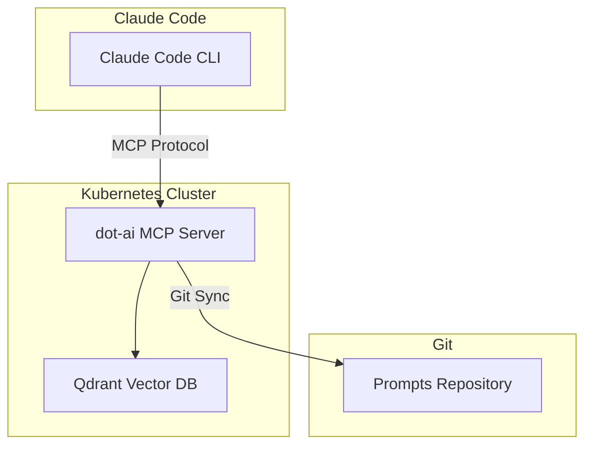

# dot-ai MCP Server


New to MCPs? Read [What is MCP?]() first.


**If I could only have one MCP server, this would be it.**


**Why "only one" matters:** MCP servers consume context window — each tool definition takes tokens. Having too many MCPs globally means Claude starts every conversation with less room for actual work. Be strategic: keep global MCPs minimal (only essential, always-needed tools) and use per-repo MCPs for project-specific tools. See [AI Tips]() for more on this strategy.






[dot-ai](https://devopstoolkit.ai/) is an AI-powered MCP server for Kubernetes operations created by [Viktor Farcic](https://www.linkedin.com/in/viktorfarcic/). It does many things, and Viktor continuously improves it and adds new features. I'm trying to keep up and explore which functions would improve my workflow — I've only begun to scratch the surface.

## What dot-ai Does

| Feature | Description | My Usage |
|---------|-------------|----------|
| **Shared Prompts Library** | PRD workflow (`prd-create`, `prd-next`, `prd-done`) + custom prompts via git sync | **Active** |
| Resource Provisioning Intelligence | Discover cluster capabilities, match intent, generate manifests, auto-install tools via Helm | Not yet |
| Issue Remediation | AI-powered root cause analysis with multi-step investigation and executable commands | Not yet |
| Cluster Query | Natural language questions about clusters without kubectl syntax | Not yet |
| Pattern & Policy Management | Capture organizational knowledge and governance policies in vector DB | Not yet |
| Project Setup & Governance | Generate 25+ files (LICENSE, CONTRIBUTING, SECURITY, workflows, Renovate, etc.) | Not yet |

So far I'm actively using two features (shared prompts and PRDs), but the cluster query capability is worth highlighting:

**Shared prompts** — I wanted to try this out, though I don't really need it yet since I'm not sharing prompts with a team. But it works well and the prompts appear as `/dot-ai:prompt-name` in Claude Code. See my [Saved Prompts]() for examples.

**PRDs workflow** — This is fantastic and I highly recommend it. dot-ai includes built-in project management prompts that form a complete lifecycle:

| Command | Purpose |
|---------|---------|
| `prd-create` | Create a comprehensive PRD with problem statement, solution, success criteria |
| `prd-start` | Begin implementation — creates feature branch, identifies first task |
| `prd-next` | Analyze PRD and recommend the highest-priority next task |
| `prd-update-progress` | Update PRD checkboxes based on git commits and code changes |
| `prd-done` | Complete workflow — push changes, create PR, merge, close issue |

**The killer feature:** PRDs break big tasks into small, independent chunks. You don't have to worry about AI context limits on large projects — just run `prd-next`, complete a few tasks, clear the context, and start fresh. The PRD file itself maintains continuity across sessions.

More on this in the Technical Deep Dive tab. Also check out the video below:



*"How I Tamed Chaotic AI Coding with Simple Workflow Commands"*

### Cluster Query: Semantic Search for Kubernetes

One of the most promising dot-ai features is **Cluster Query**, which solves a fundamental problem: `kubectl get all` is a lie. It returns maybe 10% of what's actually in your cluster.

The problem is that Kubernetes uses etcd (a key-value store) which was never designed for complex querying. Finding "all databases" means guessing at resource names (`database`, `db`, `postgresql`, `psql`...) across 356+ resource types and multiple API groups. That's a bash scripting nightmare.

dot-ai's approach: sync Kubernetes metadata into **Qdrant** (a vector database), enabling both traditional structured queries and **semantic search**. Ask "find all databases" and it returns PostgreSQL StatefulSets, CloudNativePG clusters, Qdrant instances, and AWS RDS resources via Crossplane, all in milliseconds instead of minutes of iterative kubectl calls.



*"Why Kubernetes Querying Is Broken and How I Fixed It" - Viktor explains the vector DB approach and demonstrates natural language cluster queries.*

How it works under the hood:



*Qdrant is deployed as part of the full dot-ai stack. It powers the Cluster Query feature by storing synced Kubernetes metadata for semantic search.*

## Other dot-ai Related Videos



*"AI Meets Kubernetes" — Viktor demonstrates the deployment recommendation workflow from intent to running application.*



*"Why Your Infrastructure AI Sucks (And How to Fix It)" — Deep dive into capabilities discovery, organizational patterns, policy enforcement, and structured workflows.*





## Deployment

dot-ai has multiple components — see [dot-ai-stack](https://github.com/vfarcic/dot-ai-stack) for details. I initially started with just the MCP server, which is enough for shared prompts and PRDs. Recently I switched to the full stack to test the other features, including Qdrant vector DB and the web UI.

The stack runs in Kubernetes, deployed via Helm:

```yaml
# Simplified helm values
dot-ai:
  image: ghcr.io/vfarcic/dot-ai:0.195.0

  env:
    DOT_AI_USER_PROMPTS_REPO: "https://git.example.com/my-org/prompts"
    DOT_AI_USER_PROMPTS_BRANCH: "main"
    DOT_AI_USER_PROMPTS_CACHE_TTL: "900"  # 15 minutes

  ingress:
    host: dot-ai-mcp.example.com

qdrant:
  enabled: true
```

### Connecting Claude Code

Add the MCP server to your `.mcp.json` configuration:

```json
{
  "mcpServers": {
    "dot-ai": {
      "type": "http",
      "url": "http://dot-ai.example.com",
      "headers": {
        "Authorization": "Bearer $DOT_AI_AUTH_TOKEN"
      }
    }
  }
}
```

See the [dot-ai Quick Start guide](https://devopstoolkit.ai/docs/mcp/quick-start) for full setup details.

### Refreshing Prompts

Prompts auto-refresh based on cache TTL (15 minutes in my setup). For immediate refresh:

```bash
# Restart the pod to clear cache
kubectl rollout restart deployment/dot-ai -n dot-ai
```

---

## How Custom Prompts Work

dot-ai syncs prompts from a git repository and makes them available as MCP tools. When connected to Claude Code, they appear as `/dot-ai:prompt-name` commands. Built-in prompts include `prd-create`, `prd-next`, `prd-done` for PRD workflows, plus Dockerfile and CI/CD generation.

### Prompt Format

Each prompt is a markdown file with YAML frontmatter:

```yaml
---
name: crossplane-kcl
description: Crossplane v2 and KCL composition development guide
category: infrastructure
---

# Crossplane v2 + KCL Guide

[Content follows...]
```

The `name` field becomes the command: `/dot-ai:crossplane-kcl`

### My Prompt Library

| Prompt | Purpose |
|--------|---------|
| `hai` | This blog — Hugo content, writing style |
| `crossplane-kcl` | Crossplane v2 + KCL composition development |
| `wxs-app` | Full app deployment workflow (Helm + Crossplane + Flux) |
| `renovate` | Renovate configuration and regex testing |
| `forgejo-actions` | CI/CD workflow development |
| `vpa` | VPA setup and memory optimization |
| `k8s-cleaner` | Orphaned resource detection |

See [Saved Prompts]() for details on each.

---

## PRDs: Planning Before Implementing

Before starting any significant work, I write a **Product Requirements Document (PRD)** that Claude helps me execute. This prevents scope creep and ensures clear success criteria before writing code.

### Example: This Blog

When I wanted to create this blog, I started with a PRD:

**Problem Statement:**
> Need a public blog for homelab adventures content. Current options involve maintaining K8s infrastructure (containers, GitOps deployments) which adds operational overhead for what should be a simple static site.

**Solution:**
> Hugo static site with source hosted in Forgejo, built via Forgejo CI, deployed to GitHub Pages for free hosting with SSL.

**Success Criteria:**
1. Blog accessible at `hai.wxs.ro` with valid SSL
2. Posts render correctly with theme features (search, dark mode, diagrams)
3. CI/CD pipeline deploys on push to main
4. Zero infrastructure maintenance

Claude worked through each milestone systematically using `prd-next` to identify the highest-priority task at each step.

### PRD Workflow

1. **Identify the problem** — what are you trying to solve?
2. **Draft PRD** — problem statement, proposed solution, success criteria
3. **Research** — gather documentation, evaluate options, identify gotchas
4. **Refine** — update PRD based on research findings
5. **Implement** — work through milestones with `prd-next`
6. **Complete** — mark done with `prd-done`

{}

```markdown
# PRD: Hugo Blog with GitHub Pages Deployment

**Status**: Complete
**Priority**: High

## Problem Statement

Need a public blog for homelab adventures content. Current options involve
maintaining K8s infrastructure (containers, GitOps deployments) which adds
operational overhead for what should be a simple static site.

## Solution Overview

Hugo static site with source hosted in Forgejo, built via Forgejo CI,
deployed to GitHub Pages for free hosting with SSL.

### Architecture

Forgejo repo → push to main → Forgejo CI (hugo build) → push to gh-pages → Forgejo Mirror Sync → GitHub Pages → hai.wxs.ro

### Why GitHub Pages?

| Criteria       | Benefit                                    |
|----------------|-------------------------------------------|
| Infrastructure | None - fully managed                       |
| Cost           | Free hosting + free SSL                    |
| Maintenance    | Zero - no containers, no K8s              |
| Performance    | CDN-backed, excellent Lighthouse scores    |

## Success Criteria

- [x] Blog accessible at hai.wxs.ro with valid SSL
- [x] Posts render correctly with theme features
- [x] Search functionality works
- [x] Dark mode toggle works
- [x] Mermaid diagrams render
- [x] CI/CD pipeline deploys on push to main

## Milestones

### Milestone 1: Hugo Site Scaffolding ✅
- [x] Initialize Hugo site with theme
- [x] Configure hugo.yaml with site settings
- [x] Create initial content structure
- [x] Verify local development works

### Milestone 2: GitHub Repository Setup ✅
- [x] Create GitHub repository for gh-pages
- [x] Configure GitHub Pages with custom domain
- [x] Add CNAME file to repository

### Milestone 3: Forgejo CI Pipeline ✅
- [x] Create workflow file for Hugo build
- [x] Configure GitHub push credentials
- [x] Test automated deployment on push

### Milestone 4: DNS Configuration ✅
- [x] Add CNAME record to dnscontrol
- [x] Verify DNS propagation
- [x] Confirm SSL certificate provisioned

### Milestone 5: Content & Launch ✅
- [x] Create first blog post
- [x] Test all theme features

## Risks & Mitigations

| Risk                  | Mitigation                                    |
|-----------------------|-----------------------------------------------|
| GitHub Pages outage   | Low impact - can switch to alternative later  |
| Theme updates breaking | Pin theme version, test updates in branch    |
```

{}


**Want to see a real PRD?** If you're not faint of heart, ask me for my [ArgoCD-to-Flux migration](/migrations/argocd-to-flux/) PRD — 1039 lines of milestones, tasks, and research. It's done now, and ArgoCD is decommissioned.






---

## Resources

**Documentation:**
- [DevOps AI Toolkit](https://devopstoolkit.ai/) — Official site
- [MCP Prompts Guide](https://devopstoolkit.ai/docs/mcp/guides/mcp-prompts-guide) — Full list of built-in prompts
- [GitHub: vfarcic/dot-ai](https://github.com/vfarcic/dot-ai) — Source code
- [PulseMCP: dot-ai](https://www.pulsemcp.com/servers/vfarcic-dot-ai) — MCP server listing

**Videos:**
- [DevOps Toolkit YouTube Channel](https://www.youtube.com/@DevOpsToolkit) — More AI + Kubernetes content

---

*If you made it this far, scroll back up and check out the **Technical Deep Dive** tab — it covers deployment, custom prompts, and the full PRD workflow.*

