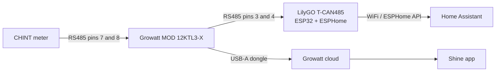

# Local solar monitoring with Claude



**TL;DR:** My Growatt PV monitoring in Home Assistant runs through Growatt's cloud, and the read-only guest account I have keeps getting rate-limit-locked (`Growatt login failed: 507`) by the HA integration polling it. I wanted a local feed instead. With Claude doing the research, reading the inverter manual, writing the ESPHome config, and walking me through the wiring, I added a local RS485/Modbus link on a LilyGO T-CAN485 (an ESP32) that reads the inverter directly, in parallel with the cloud. It works, the data is richer than the cloud ever gave me, and the only thing that went wrong was me forgetting which wire color I had used.


## The problem: a guest account that keeps getting locked

My solar setup was installed by a company, so my Growatt account is a **read-only guest**. That has two annoying consequences:

1. A guest account **cannot generate an API token**, so the [Home Assistant](https://www.home-assistant.io/) `growatt_server` integration is stuck on username/password auth. Growatt rate-limits that hard, and the integration's polling regularly trips it. The result is a recurring `Growatt login failed: 507` and a locked account until it cools off.
2. Even when the cloud works, it **zeroes the device-level sensors** (per-string voltages, per-phase power). Only the plant-level totals are accurate.

So I had monitoring that was both flaky and shallow, and no way to fix the auth from my side. The obvious move: stop leaning on the cloud and read the inverter **locally**.

The inverter (a Growatt MOD 12KTL3-X) speaks Modbus over RS485 on its COM port. If I could put something on that bus that talks to [Home Assistant]() over WiFi, I would get full device-level data with no cloud, no rate limits, and no 507. The cloud and the Shine app could keep running in parallel on their own channel. Best of both.

## Where Claude actually helped

This is the part I want to highlight, because it was not "Claude wrote a script." It was a multi-day back-and-forth where Claude did the tedious, error-prone research I would normally half-do and get wrong.

- **Read the manual so I did not have to.** Claude pulled the 40-page MOD 3-15KTL3-X PDF, found the communication section, and extracted the exact COM connector pinout: pins 3/4 are the RS485 monitoring bus (inverter is Modbus slave 1, 9600 8N1), pins 7/8 are the meter bus, leave them alone.
- **Cross-checked the pinout instead of trusting one source.** It confirmed pins 3/4 against the manual, a community wiring guide, and a known-good reference build before I touched anything. Wiring the wrong pins on a live inverter is not where you want a hallucination.
- **Wrote the ESPHome config.** It adapted [a reference YAML](https://github.com/JasperE84/Growatt_ESPHome_ESP32_Modbus_RS485_Example) for my specific inverter: added the third PV string and the second and third AC phases, and dropped every write register so the thing is strictly read-only (I do not want my monitoring box able to switch the inverter off).
- **Sanity-checked the live numbers** once it was running (more on that below).

## The hardware

| Item | Detail |
|------|--------|
| Board | **LilyGO T-CAN485** (ESP32 + built-in RS485 + WiFi), about EUR 23 on a local retailer (cheaper if you import) |
| Power | USB-C 5V, any phone charger, at the inverter |
| Link to HA | WiFi (the inverter is far from the HA host, so an ESP32 beats a USB-RS485 dongle) |
| Firmware | ESPHome, read-only Modbus |

Here is the shape of it. The local RS485 link and the existing cloud dongle run on completely independent channels, so adding one does not disturb the other:



## The config


**Credit where it is due:** my config is an adaptation of [JasperE84's Growatt ESPHome RS485 example](https://github.com/JasperE84/Growatt_ESPHome_ESP32_Modbus_RS485_Example), same LilyGO T-CAN485 board, a different MOD model. They did the hard reverse-engineering and published a clean, working reference, which is most of the reason this was an afternoon and not a lost weekend. Thank you.


The whole thing is an ESPHome `modbus_controller` reading input registers. Simplified to one sensor for clarity:

```yaml {filename="growatt-mod12k.yaml (excerpt)"}
modbus_controller:
  - id: modbus_pv
    address: 1            # inverter is Modbus slave 1, 9600 8N1
    update_interval: 30s

sensor:
  - platform: modbus_controller
    modbus_controller_id: modbus_pv
    name: "AC Output Power"
    address: 35           # Pac, 32-bit value, scale x0.1 W
    register_count: 2
    register_type: read   # input register (function code 04)
    unit_of_measurement: W
    device_class: power
    value_type: U_DWORD
    filters: [multiply: 0.1]
```

Multiply that out across three PV strings, three AC phases, energy counters, and temperatures and you have a board reading more detail than Growatt's cloud ever exposed, every 30 seconds, entirely on my LAN.

Flashing has one catch worth knowing: the very first flash has to be over USB, because a blank board has no firmware to receive an over-the-air update yet. After that, every change goes over WiFi.

```bash
esphome run growatt-mod12k.yaml                                # first flash, over USB
esphome run growatt-mod12k.yaml --device growatt-mod12k.local  # later updates, over WiFi
```

## The wire

Here is the embarrassing part. I wired the two RS485 wires in, powered up, and got... total silence: every sensor "unknown", nothing but Modbus timeouts.

The firmware was clearly fine (the board was transmitting), so it had to be the wire. I checked the obvious things and swapped A and B. Still nothing. The actual cause: I had used the wrong wire. The colors I thought I had run were not the ones I had actually run.

A two-minute mistake with a one-hour fix. Redoing the wire means reopening the Growatt's waterproof COM connector, which you are meant to pop open with a little H-shaped tool that ships with the inverter. I did not have it. So it took the better part of an hour, two screwdrivers, and one wife to wrestle the terminal block out, redo the wire, and seal it all back up. Doing that because you cannot remember whether you used the blue or the orange wire is exactly as fun as it sounds.


**Lesson, paid for in full:** label your wires the first time. Claude can read a 40-page manual and cross-check a pinout against four sources. It cannot see which wire you actually pushed into which hole. That part is still on you.


## The payoff

With the right wire in the right hole, the inverter answered immediately: zero timeouts, every sensor live.


I had Claude do one last pass: sanity-check the numbers against each other. They line up almost perfectly, which is the satisfying kind of proof that nothing is fudged:

- The three PV strings sum exactly to the reported PV total.
- Each string's voltage times current equals its power.
- The three phase powers sum to the total AC output, within a fraction of a percent.
- AC output sat around 99% of DC input in each snapshot, which is the right ballpark for an inverter rated near 98.6% max (the exact figure wobbles because the AC and DC registers are read about a second apart on a moving target).

That last set of cross-checks also settled a labeling question: the per-phase power registers are real watts, not apparent VA, because they sum to real AC output. Small thing, but it is the kind of detail the cloud never gave me and that I now have, locally, forever.

And the whole point of the exercise: it lands in Home Assistant as a plain local device, every sensor an entity, no cloud round-trip and no 507 in sight.


## What I take away from this

The division of labor turned out uneven, and not in the direction the hype would suggest. Claude did the careful, research-heavy, easy-to-get-wrong work: reading the 40-page manual, refusing to trust a single source for the pinout, and writing a strictly read-only config that could not do anything dangerous to the inverter. None of it was wrong.

The mistakes were all mine. I used the wrong wire, I could not remember which colors I had run, and I burned an hour reopening a connector with two screwdrivers and a patient wife. In the end the human made more silly mistakes than the AI did. This time, anyway.

