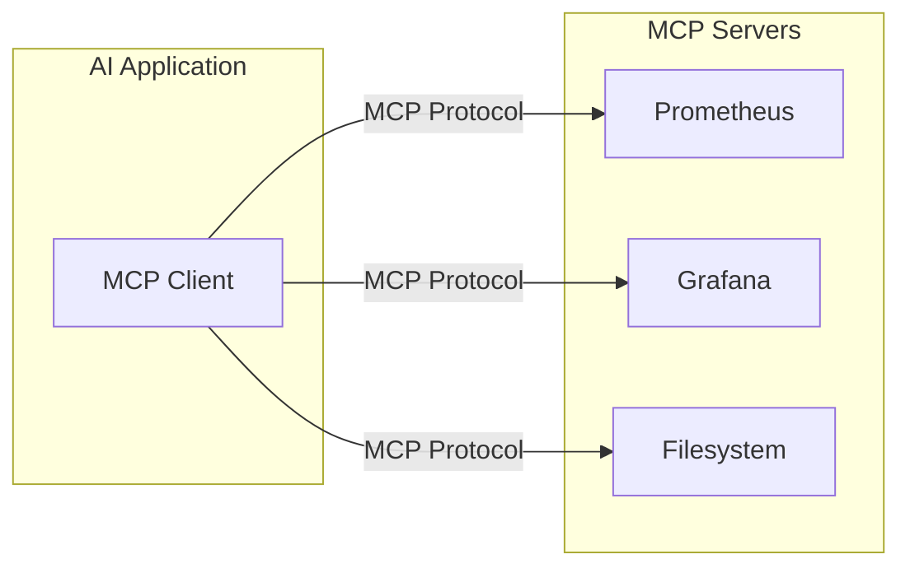

# What is MCP?

**MCP (Model Context Protocol)** is an open standard that lets AI assistants connect to external tools and data sources. The simplest way to think about it: **MCPs are APIs for AI agents**.

Just like REST APIs let applications talk to services, MCP lets AI assistants talk to tools — databases, monitoring systems, file systems, documentation, anything. Same concept, different consumer.

## The Problem MCP Solves

Without MCP, every AI integration is custom-built. Want Claude to query Prometheus? Build a connector. Access Grafana dashboards? Another connector. Search documentation? Another one. Each integration is bespoke, fragile, and duplicated across every AI tool.

MCP flips this: **build once, use everywhere**. A Prometheus MCP server works with Claude Code, ChatGPT, VS Code Copilot, and any other MCP-compatible client. The server exposes capabilities; the client consumes them.

## How It Works

MCP uses a client-server architecture:

Servers expose three types of capabilities:

| Type | What it does | Example |
|------|--------------|---------|
| **Tools** | Functions the AI can execute | Run a PromQL query |
| **Resources** | Data the AI can read | Fetch a Grafana dashboard |
| **Prompts** | Templated workflows | PRD creation workflow |

## Why It Matters

MCP became the industry standard fast. Anthropic created it in November 2024; by 2025, OpenAI and Google DeepMind adopted it. In late 2025, Anthropic donated MCP to the Linux Foundation's Agentic AI Foundation.

The ecosystem now has thousands of community-built servers, official SDKs for all major languages, and 97M+ monthly downloads.

## MCP Servers I Use

| Server | Purpose |
|--------|---------|
| [dot-ai]() | Kubernetes operations, shared prompts, PRD workflows |
| [Grafana](https://github.com/grafana/mcp-grafana) | Dashboard queries, alerts, incidents |
| [Prometheus](https://github.com/punkpeye/awesome-mcp-servers) | PromQL queries, metric exploration |
| [Context7](https://context7.com/) | Up-to-date documentation for any library |
| [Arc DevTools]() | Browser control via Chrome DevTools Protocol |


MCP servers consume context window. Be strategic — keep global MCPs minimal and use per-repo configs for project-specific tools. See [AI Tips]().


## Learn More



*"The Missing Link: How MCP Servers Supercharge Your AI Coding Assistant"*

---



*"MCP Servers Explained: Why Most Are Useless (And How to Fix It)"*

**Related:** [Commands vs MCP vs Skills]() — How MCP compares to other agent extension mechanisms.

**Resources:**
- [MCP Specification](https://modelcontextprotocol.io/specification/2025-11-25) — Official protocol docs
- [MCP GitHub](https://github.com/modelcontextprotocol) — SDKs and reference servers
- [Awesome MCP Servers](https://github.com/punkpeye/awesome-mcp-servers) — Community server collection
- [Anthropic MCP Announcement](https://www.anthropic.com/news/model-context-protocol) — Original introduction

