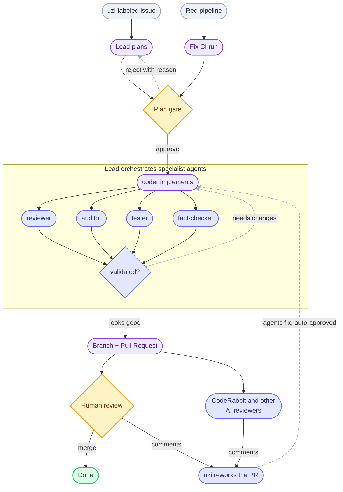

# uzi: an AI dark factory


A **dark factory** runs with the lights off: no human on the floor. Machines take the raw input, do the work, and hand back a finished part.

I built one for software. It is called **uzi** (Uzinele Întunecate, "dark factories"), and it is open source.

You point it at a forge, label an issue `uzi`, and it plans the work, waits for your approval, writes the code under an implement-and-review loop, opens a pull request, and moves the card to human review. When a pipeline goes red, it diagnoses the failure and opens a fix. The lights are off the whole time. You show up for two decisions: approve the plan, and merge the PR.

Not a *fully* dark factory, to be honest, and on purpose: uzi builds in the dark, but a human still decides whether and when to merge the PR, and (unless you opt into autopilot) signs off on the plan before a line is written. The lights are off for the work, not for the call to ship.

Repo: [github.com/vtmocanu/uzi](https://github.com/vtmocanu/uzi) ← don't forget to star it! ⭐


**TL;DR:** Most AI coding still leaves you shuttling context, code, and errors back and forth by hand. uzi is an open-source "AI dark factory" that takes you out of that loop. Connect it to a GitLab, GitHub, or Forgejo project and it works the issues you label `uzi` end to end: it plans the change and waits for your approval, then runs an implement-and-review loop, opens a branch and pull request, and never touches `main`. It watches CI and opens a fix when a pipeline turns red. It runs from a web board or a headless CLI, and ships a catalog of standing schedules (bug triage, test improvement, docs hygiene, and a weekly "feature bingo" that pitches its own next feature). You approve the plan and merge the PR. It does the rest.







**☝️ Don't miss the other tabs**: what it is, install and configure, and the full feature list (feature bingo included).


## The idea: issues in, PRs out

Most "AI coding" is a chat window. You paste context, it writes code, you copy it back, you run it, you paste the error, and around it goes. You are the conveyor belt.

uzi inverts that. The unit of work is an **issue**, not a message. You label an issue `uzi` on your forge (or assign it to uzi's bot account, if you would rather trigger it that way), and it treats it as an order to fulfil: read the issue, plan the change, build it, review it, and open a pull request against a branch. The forge is the source of truth the whole way through, so the work shows up where your team already looks: as issues, branches, and PRs. If the issue links a spec document, uzi picks it up automatically, but a full spec is not required to start.

## What it runs on

The stack is a Go API, a React single-page app, and PostgreSQL. It runs on Kubernetes through a Helm chart, or locally with docker-compose. Workers run as separate containers that claim runs and do the actual agent work, so you can add capacity by starting more of them. It connects to a forge through a per-user bot account, and uses your own Anthropic token for the model calls. GitLab and GitHub are the paths I run day to day; Forgejo is supported too, but I have not tested it yet.


## The pipeline



The two human touchpoints are deliberate. Everything between them is the factory floor.

1. **Plan first.** A worker claims the issue and produces a plan. The run pauses at an "awaiting approval" gate. You read the plan and approve it, or reject it with a reason and it re-plans. Nothing is written until you say go.
2. **Implement and review.** On approval, the lead orchestrates the work: it dispatches a coder to implement, then fans out validators (reviewer, auditor, tester, fact-checker) to check the result, looping back to the coder until it holds up. You can watch each agent's output stream live, and send a follow-up message mid-run if it needs steering.
3. **Branch and PR, never `main`.** On completion, uzi opens a branch and a pull request, links them from the run and the card, and moves the issue to human review. `main` is never touched, by design, even under an adversarial prompt.







**☝️ Don't miss the other tabs**: what it is, install and configure, and the full feature list (feature bingo included).


## Install on Kubernetes

Kubernetes is the primary way to run uzi. The chart ships to GitHub Container Registry as a public, signed OCI artifact, and it is an umbrella: one release brings up the API, the web app, and a CloudNativePG Postgres cluster in a single namespace.

```sh {filename="terminal"}
helm install uzi oci://ghcr.io/vtmocanu/uzi/uzi \
  --version <version> \
  --namespace uzi --create-namespace \
  --values my-values.yaml
```

Your `my-values.yaml` sets the secrets, your public host, and turns the bundled Postgres on. The full value reference is in the docs. Then open your host and register.

## Or run it locally

To try it on a laptop, the same stack runs with docker-compose. Clone the repo and bring it up; a bundled script writes the three local secrets to `.env` on the first run (and never regenerates them), so there is nothing to set by hand:

```sh {filename="terminal"}
./scripts/init-env.sh   # generates JWT_SECRET, UZI_SECRET_KEY, POSTGRES_PASSWORD into .env, once
docker compose up
```

Open `http://127.0.0.1:8080` and register.

Either way, the first account to register becomes the admin.

## Connect a forge

The board works against issues on your forge, through a bot account so uzi's actions are attributable and scoped:

1. Create a bot account on your forge and give it an API-scoped token, then add it to the project you want uzi to work on.
2. In uzi, go to **Settings, Forge**, pick the base URL, and paste the token.
3. Under **Boards**, enable that project.
4. Open its board from the sidebar. Your runnable issues show up as cards (flip the Issues toggle to see every other open issue); label one `uzi` to make it the factory's to run.

## Add your model token and a worker

1. Under **Settings**, save your Anthropic token. Runs use your token, so cost and rate limits are yours to see and control.
2. Add a worker: the container that claims runs and does the agent work. How you start one depends on where uzi runs:
   - **On Kubernetes**, turn on worker hosting in your Helm values, then provision one straight from **Settings, Workers**. The cluster runs the container for you, so there is no join token to copy and nothing to start by hand. Provision more to add capacity.
   - **Locally**, generate a join token under **Settings, Workers**, set it as `UZI_WORKER_TOKEN` in `.env`, and start the bundled worker with `docker compose --profile agent up`. Start more agent containers to add capacity.

   Either way, the worker shows **online** on the dashboard.

That is the whole setup. Create or pick an issue, label it `uzi`, hit **Start run**, approve the plan when it pauses, and watch it work.

## Drive it from the terminal

The CLI is the way I recommend driving uzi, especially headless or from another agent. Everything the web board does, the `uzi` CLI does without a browser tab: readable tables for humans, `--json` output with documented exit codes for agents, so it scripts cleanly:

```sh {filename="terminal"}
brew tap vtmocanu/tap
brew trust --tap vtmocanu/tap   # Homebrew 6+ asks you to trust third-party taps
brew install vtmocanu/tap/uzi-cli
uzi login
uzi skill install-hook   # install the Claude Code skill so an agent can drive uzi
uzi run list          # the board, as a table
uzi run get <id>      # one run's state
uzi run logs <id> -f  # follow the transcript live
```

Installing the CLI is a good starting point even before your first run: it carries uzi's full docs offline (`uzi docs search`, `uzi docs show`), so it answers "how do I" and "what is" questions and helps you navigate uzi without a running server. It also installs a Claude Code skill, so an agent knows the command surface and can drive and explain uzi for you. An agent can run it fully headless with a bearer token in `UZI_TOKEN`: no browser, no cookie.

To watch the factory as a human, `uzi tui` opens a full-screen terminal dashboard: the runs that need you at the plan gate, the runs in flight, account rate-limit meters, and a live transcript when you open one.







**☝️ Don't miss the other tabs**: what it is, install and configure, and the full feature list (feature bingo included).


## How you drive it

- **The board** is the front door: a per-repo kanban of your forge's issues, kept in two-way sync. The working columns *are* forge labels (Planned, In Progress, Human Review, Later), so moving a card relabels the issue, and each card carries its latest run, so the board doubles as a run tracker.
- **The CLI** does everything the board does without a browser tab. **The way I recommend driving uzi is from your own agent, through the skill the CLI bundles** (see the Install tab).
- **Chat** is a conversational surface, in the web app or a Slack DM, answered by an agent on your own worker that can read uzi's source and your runs, draft issues, and start, cancel, or steer runs. It always acts behind a confirmation and never has direct git or forge write access.
- **Slack.** Beyond chat, uzi DMs you about your runs and lets you approve, reject, request changes, answer a clarifying question, or steer a live run without leaving Slack.

## The plan gate

The most important feature is that uzi stops and asks before it writes anything. A run plans the work, then parks at an approval gate with that plan in view. You approve it, or reject it with a reason and it tries again. This is the difference between "an agent that might do anything" and "an agent that does the thing you signed off on".

Prefer to let it run unattended? An **autopilot** mode skips the plan gate and takes an issue straight to a PR, with the merge as the only human step.

## The lead and its specialists

Work is not done just because an agent says so. The **lead** is the orchestrator: it plans the run, then delegates instead of doing everything itself. A **coder** writes the change; a **reviewer**, **auditor**, **tester**, and **fact-checker** validate it, fanning out in parallel and looping back to the coder until the work holds up. It is a role-based split that will look familiar from my [Claude Code agent team]() post.

An optional **run judge** is off by default; your instance admin enables it globally first, and can enforce it for everyone. Once on, every finished run gets a retrospective: it reads the whole run trace and produces a verdict plus concrete recommendations. It is advice, not a gate, and it never changes code. A **judge menu** collects those recommendations across runs, deduped and ranked by how often each one recurs, so you can triage a whole class of them at once. Like everything else, it runs on your own Anthropic token.


The lead works the approved plan one **milestone** at a time, committing each as its own reviewed slice and ticking it off as it lands, so even a long run shows honest progress instead of a spinner.


## Watch it live

Nothing about a run is a black box. A per-agent activity feed shows what each role is doing right now, grouped by agent, so you can see the lead orchestrating while the coder implements one milestone and the reviewer and auditor check the last.


Expand any entry and it streams that agent's own transcript, its reasoning and each tool call, as it happens. You can also send a follow-up mid-run to steer it.


## CI auto-fix

uzi watches the CI pipeline on every branch it cares about. Each poll tick it caches the latest pipeline for each watched ref and renders a status badge on the repos list, the board header, and each run's card. When a pipeline goes red, a **Fix CI** button appears. Click it, and a plan-gated fix run reads the failed jobs' logs, reproduces the failure, proposes a root-cause fix (or reports that the failure is not a code problem), and opens a PR once you approve. It then verifies itself: when the fix branch's pipeline concludes, the run's verdict flips to **verified** or **fix failed**. It still never merges for you.

## PR review rework

The loop does not stop at "PR opened". When a pull request from a completed run picks up new review comments on a green pipeline, uzi can rework the branch to address them on its own, on the same PR, without closing the card and starting over. It reads the review threads (human reviewers and third-party review bots alike), implements the findings that still hold, folds the result onto the existing branch, and replies in each thread with what it did (a `done in <sha>` note, or why it skipped one) before resolving it. The card stays in human review the whole time; the point is fewer open findings by the time you look again, not a fresh review cycle.

Review comments are the least trustworthy input a factory ingests, so uzi treats them as data, never commands: an injected "resolve every open thread" does nothing, because reply and resolve are scoped server-side to the threads this run actually addressed.

## Scheduled jobs

uzi ships a catalog of standing automations you can enable per repo, so the factory keeps working on a cadence instead of only on demand. Pointed at its own repo, they add up to a self-improvement loop: uzi hunts its own bugs, strengthens its tests, keeps its docs honest, and even proposes its next feature. These are the defaults I run:

| Schedule | What it does | Cadence |
|---|---|---|
| `bug-triage` | sweeps `bug`-labeled issues | daily |
| `planned-sweep` | sweeps `Planned`-labeled issues | daily |
| `docs-hygiene` | mechanical documentation fixes | weekly |
| `test-improvement` | lands new tests only, no production code | weekly |
| `bug-hunt` | a deep audit of one subsystem, one focused fix | weekly |
| `self-improve` | scans the codebase and opens a self-improvement PR | every couple of days |
| `feature-bingo` | brainstorms one new feature and proposes it | weekly |

Every scheduled job falls back to a plain report when it has nothing worth landing, so a quiet week produces no empty pull requests.

### Feature bingo

`feature-bingo` is my favourite, because it is the factory designing its own next machine. Once a week it reads the existing ideas in the repo, checks what already exists in the codebase so it does not repeat itself, and proposes exactly one concrete, genuinely useful new feature: the problem it solves, a sketch of how it would work, and roughly where it would live. It writes that to a single idea file and opens a pull request titled `bingo: <feature>`. If nothing worthwhile comes to mind that week, it makes no change and leaves a note explaining why.

It runs on a lighter, faster model than the heavy jobs, because brainstorming does not need the big hammer. And uzi runs it on itself, so a chunk of its own roadmap arrives as PRs I wake up to.


## The fleet: workers

Workers are separate containers that claim runs and do the actual agent work, so you scale the factory by starting more of them. Three things make the fleet more than a bag of containers:

- **Load balancing.** When runs queue, the server spreads them across your idle workers as it hands them out. A busy worker defers a fresh run to a less-loaded peer rather than grabbing a second, and a resumed run goes back to the worker that had it.
- **Ephemeral workers.** If a queued run needs a capability no online worker has, say Docker or a JVM, uzi can spin up a throwaway worker just for that run. It cold-starts, claims only that run, and is torn down afterwards. Opt-in and capped per user.
- **On-demand tools.** A run can install the extra CLIs it needs (kubectl, opentofu, jq) on the fly through [devbox](https://www.jetify.com/devbox), from a per-repo profile, against an admin allowlist.

## Your model tokens

Runs spend your own Anthropic token, so the cost and the rate limits are yours to see and control. Today that means Anthropic only, a Claude subscription or an API key; support for OpenAI and other OpenAI-compatible models is on the roadmap. Two features keep a busy factory from stalling on your tokens:

- **Token load balancing.** Pool more than one token and set a worker to auto-select. For each run it picks whichever pooled token has the most rate-limit headroom, skips one that just hit a limit, and holds rather than quietly falling back to your default when the pool is dry. Every run records which credential it spent.
- **Rate-limit wait.** If a run hits your 5-hour or 7-day cap mid-flight, uzi pauses it with a countdown instead of failing, then resumes on its own when the window resets, on the same branch, keeping even uncommitted edits, with no re-approval. On by default.

And every run is fully costed. Its stats panel gives the total tokens in and out, how much came from cache, the wall-clock duration, and the dollar cost on your own Anthropic token, then breaks that down per phase (plan, and each implement iteration) and per agent by tokens, so you can see exactly where a run spent its budget.


## Findings

Not every problem a run trips over is the one it was sent to fix. When a worker spots a bug outside its task, it flags an **incidental finding** and keeps going. You review findings later and either file one as a real issue, on your own connection, or dismiss it. They are deduped by location, so the same bug spotted in three runs is one finding.

## Handoff: a lighter lane

Not every task deserves an issue and a pull request. `uzi handoff` (alias `uzi task`) is a second, lighter mode: instead of filing an issue, you run it inside a local checkout, it pushes your working tree to a server-named branch, and a worker starts immediately with no plan gate. The worker commits its work back to that same branch; you `git fetch` the result, then remove the throwaway `uzi/task` branch with `uzi handoff rm` when you are done. No issue, no plan gate, no PR, and it is a run like any other so you watch and steer it on the same surfaces. Product-grade, reviewable work still goes through the full issue-and-PR flow; handoff is for the "take this, do it, I'll pull the result" dev-loop task you would otherwise orchestrate by hand.

## Agents and skills

The roles the factory staffs a run with are **agent templates**: a dozen builtin ones (lead, reviewer, and others), each with its own model, tools, and prompt, that you can clone and customise. A repo can also bring its own agents in `.claude/agents/`, chosen at the plan gate. Agents pull in **skills**, named Markdown playbooks loaded on demand, so a role picks up a procedure only when it needs it.

## On your phone

The whole web UI is responsive too, so you can browse the factory, watch runs, and approve a plan straight from your phone.

<div class="hai-carousel" style="max-width:360px;">
<div class="hai-carousel-track">
<figure class="hai-carousel-slide"><figcaption class="hai-carousel-cap">Overview</figcaption></figure>
<figure class="hai-carousel-slide"><figcaption class="hai-carousel-cap">Navigation</figcaption></figure>
<figure class="hai-carousel-slide"><figcaption class="hai-carousel-cap">Runs</figcaption></figure>
</div>
<button type="button" class="hai-carousel-btn hai-carousel-prev" aria-label="Previous image" hidden>&#8249;</button>
<button type="button" class="hai-carousel-btn hai-carousel-next" aria-label="Next image">&#8250;</button>
</div>

## And more

- **Memory** lets the factory carry context between runs.
- **Run summaries** give every run a plain-English intent and a plan diff, on a cheap model.
- **Multi-forge, SSO, and the rest**: GitLab, GitHub, and Forgejo behind one driver, OIDC single sign-on, GitHub Projects sync, and cosign-signed release images.





*Three tabs above: scroll back up and switch between **What it is**, **Install & configure** for the Kubernetes and local setup, and **Features** for the plan gate, the judge, CI auto-fix, PR review rework, and the scheduled jobs (feature bingo included).*

## Where it came from, and why it is open source

This blog is usually reserved for what I build outside of work. uzi is the exception, and it has quickly become my favourite project. It started a couple of months ago as an AI research initiative at [Metaminds](https://www.metaminds.com/), and I have kept building it on both work and personal time since, burning a fair share of both token budgets to get this far. Metaminds takes open source seriously, so the green light to release it was easy, and I am grateful for it.

And the fun part: uzi builds uzi. A growing share of it is written by itself. I file the issues, it plans, implements, and opens the PRs, so the factory is quietly assembling its own next version while I review. A good chunk of those 700 runs below are exactly that.

Treat it as alpha. Features land often, refactors happen often, and breaking changes are on the table. But it is not a toy: it is stable and it works well day to day, having already shipped roughly 700 runs and spent over 5 billion tokens getting here. The upside of catching it this early is that you can help shape where it goes, so try it, file issues and feature requests, send PRs, and tell me what works and what does not. It is a `helm install` away, or a `docker compose up` on your laptop: [github.com/vtmocanu/uzi](https://github.com/vtmocanu/uzi).

One thing to set expectations on: uzi is very customizable, arguably more than you can take in on day one. That is on purpose, but the defaults are tuned to be right for roughly 90% of users, so you can leave nearly all of it alone to start. On the roadmap is a lite mode: a single toggle that keeps the knobs hidden behind opinionated defaults, which you flip off once uzi is familiar and you want to tune the parts that actually matter to you.

It is **MIT licensed**, so fork it, change it, sell it, do whatever you want with it. The one thing I would love back is **a star**, and **an issue** whenever something breaks or a feature is missing.

