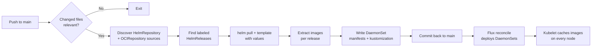

# Prepuller Action: GitOps-native Image Caching, as Code


Most Kubernetes clusters quietly rely on image pulls working. Kubelet caches whatever it has pulled, so a pod that's already running on a node stays running even if the registry is unreachable. The failure surface is the edges: a pod rescheduled to a node that has never seen the image, a new node joining the cluster, a rollout referencing a tag that hasn't been replicated to the mirror yet, or [Docker Hub rate limits](https://docs.docker.com/docker-hub/usage/) (anonymous pulls are capped at 100 per 6 hours per IP) kicking in right when a rolling update needs them. Any of those combined with a slow, flaky, or unreachable registry gets you `ImagePullBackOff`.

The usual answer is a pre-puller [DaemonSet](https://kubernetes.io/docs/concepts/workloads/controllers/daemonset/): a pod on every node whose job is to pull a set of images into the local cache and keep them there. Writing one by hand is fine. Keeping a dozen of them aligned with whatever versions your HelmReleases actually use is the chore. That's what this tool automates.

## What it does

The prepuller is a [Forgejo Action](https://forgejo.org/docs/next/user/actions/) (works the same as a GitHub Action) that reads your GitOps repo, finds every `HelmRelease` you've marked for pre-pulling, renders each chart offline, extracts the container images the chart would deploy, and writes a `DaemonSet` manifest into the repo. [Flux](https://fluxcd.io/) picks the manifests up on the next reconcile and rolls them out. From then on, those images sit in the local image cache on every node.

The opt-in is a single label on the HelmRelease:

```yaml
apiVersion: helm.toolkit.fluxcd.io/v2
kind: HelmRelease
metadata:
  name: my-workload
  namespace: platform
  labels:
    my.domain/prepuller: "enabled"
spec:
  chartRef:
    kind: OCIRepository
    name: my-workload
    namespace: flux-system
  values: {}
```

No per-workload boilerplate. No repeating the image list in a second manifest. No drift between what the chart renders and what the cache holds.

## How it works

The generator is a ~1000-line bash script packaged as a reusable action. Pipeline, in order:

1. **Discover chart sources.** Walk the repo for every `HelmRepository` and `OCIRepository` resource. Build a lookup map keyed by `namespace/name`.
2. **Discover labeled HelmReleases.** Pre-filter YAML files with `grep` (far faster than running `yq` across the whole repo), then validate each hit with `yq` to confirm it really is a HelmRelease with the label set to `enabled`.
3. **Parse each HelmRelease.** Support both source patterns: `spec.chart.spec.{chart,version,sourceRef}` (HelmRepository-backed) and `spec.chartRef` (OCIRepository-backed). For chartRef, derive the chart name from the URL basename and the version from `spec.ref.tag` or `spec.ref.semver`.
4. **Pull and template each chart.** `helm pull` for the chart, `helm template` with the HelmRelease's own values. Pass `--api-versions` for common CRDs so charts gating on `.Capabilities.APIVersions.Has` (for example, ServiceMonitor checks in monitoring stacks) don't fail when rendered offline.
5. **Extract images.** Grep the rendered manifest for `image:` lines, apply an exclusion regex for containers you never want to cache (analyzers, exporters, CI runners), and normalize any mangled paths where a chart concatenated its default registry with a user override.
6. **Emit a DaemonSet.** For each workload, write `infrastructure/prepullers/prepuller-<release>.yaml`: one tiny `initContainer` per image plus a single `pause` container to keep the pod alive. The initContainers reference the images and exit immediately. Kubelet pulls each image once while scheduling them.
7. **Regenerate the kustomization.** Rewrite `infrastructure/prepullers/kustomization.yaml` to list exactly the prepullers that should be active, so deletions propagate cleanly.
8. **Commit.** If anything changed, push a `chore: update prepuller images` commit back to `main` with `[skip ci]`. Flux deploys the new DaemonSets on the next reconcile.

The workflow triggers on pushes to `main` that touch `infrastructure/controllers/**/helmrelease*.yaml` or `infrastructure/sources/**`, plus a manual dispatch for full regeneration. A pre-check job uses `git diff` to skip the heavy work when nothing relevant changed.



The DaemonSet itself is small by design. A simplified view:

```yaml
apiVersion: apps/v1
kind: DaemonSet
metadata:
  name: prepuller-my-workload
  namespace: platform
spec:
  selector: { matchLabels: { name: prepuller-my-workload } }
  template:
    metadata:
      labels: { name: prepuller-my-workload }
    spec:
      initContainers:
        - name: prepull-my-image-0
          image: my-registry.example.com/repl-my-workload/my-image:v1.2.3
          command: ["/bin/true"]
          imagePullPolicy: IfNotPresent
      containers:
        - name: pause
          image: my-registry.example.com/pause:3.10
          imagePullPolicy: IfNotPresent
          resources:
            limits: { memory: 128Mi, cpu: "1" }
            requests: { memory: 5Mi, cpu: 5m }
```

Three details make this work in practice:

- **`imagePullPolicy: IfNotPresent`** on both init and pause containers, so kubelet reuses the local cache once it's warm.
- **The `pause` container stays running forever**, which combined with the above keeps kubelet's image garbage collector from evicting the cached layers.
- **Resource requests are minimal** so the pod schedules on nodes that are otherwise fully packed.

## Why it's beneficial

A few concrete wins that show up the moment this is in place:

- **Faster pod startup on reschedules.** When a pod moves to a new node, its image is already in the local cache. Startup goes from "pull a multi-hundred-megabyte image, then start" to "start." For critical services this is the difference between a blip and a visible outage during node maintenance.
- **Insulation from registry outages.** An unreachable registry stops hurting scheduling decisions on nodes that already have the image. In clusters where the registry is self-hosted, this breaks circular bootstrap dependencies: the components needed to bring the registry back up are already cached and don't need to be fetched from the thing that's down.
- **Protection against registry retention.** Mirrored registries often run aggressive retention (keep the last N tags, evict anything older). A regularly restarting DaemonSet acts as a steady pull signal, extending the effective lifetime of the tags you care about.
- **Insulation from Docker Hub rate limits.** Each node pulls each image exactly once; subsequent pod starts use the local cache. Combined with a pull-through mirror (Harbor, Artifactory, Nexus), the mirror absorbs the first pull and the prepuller keeps the nodes warm so nothing repeatedly hits Docker Hub.
- **Declarative and visible.** The full list of prepulled images for every workload lives as rendered YAML in the repo. Code review catches regressions ("why did this image suddenly get added to the cache?") before they hit the cluster. Diffing two commits tells you exactly which images changed.
- **Zero ongoing maintenance per workload.** Bumping a chart version changes the generated prepuller automatically at the next run. There's nothing to update by hand.

## Configuration

The action exposes a handful of inputs. In most setups you only set three or four:

```yaml
- name: Generate prepuller manifests
  uses: https://my-git.example.com/actions/prepuller@v2.4.2
  with:
    flux-monorepo: "true"
    cluster-name: my-cluster
    prepuller-output-path: infrastructure/prepullers
    prepuller-label: my.domain/prepuller
    # Optional: extend the default --api-versions list
    extra-api-versions: "cert-manager.io/v1"
```

The `cluster-name` input is a hint for where to find a `cluster-config.yaml` (a ConfigMap that defines Flux postBuild substitutions). The generator runs entirely offline and never talks to a cluster.

## What it doesn't solve

Two limits worth naming up front:

- **A brand-new node during a registry outage still has nothing.** The prepuller DaemonSet pod on that node can't pull either. Once the registry comes back, the cache fills. This is a real edge, but it's the same edge you'd have without any caching: provisioning nodes during an outage is a separate operational problem.
- **Chart-default tag drift vs. registry retention.** The prepuller caches whatever tag the chart currently uses. If a chart defaults a tag to something your registry doesn't have replicated, the cache is empty and pulls still fail. The structural fix is pinning the tag in HelmRelease values rather than trusting chart defaults.

## "Can I See The Code?"

The action isn't open-sourced. It's tied closely enough to my GitOps layout and conventions (Flux monorepo, OCIRepository-heavy, specific label scheme) that a generic release would be mostly caveats. If you're curious about the implementation or want to compare notes, feel free to ping me on [LinkedIn](https://www.linkedin.com/in/vtmocanu). Happy to share and chat about it.

