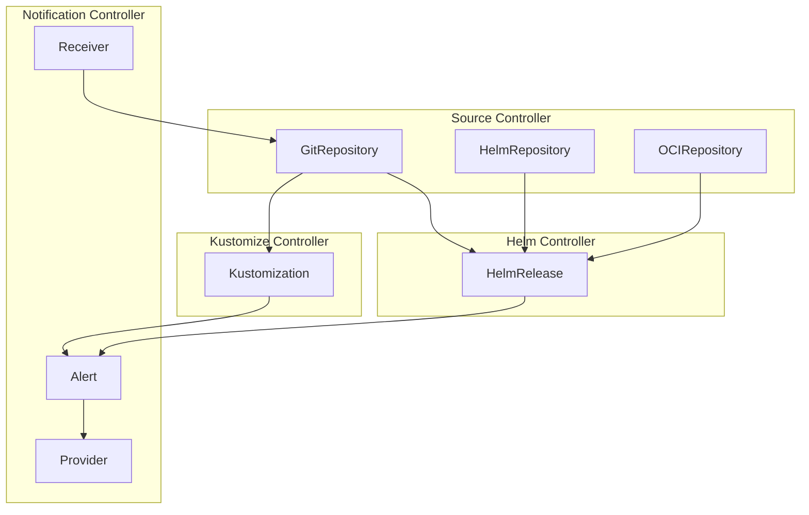
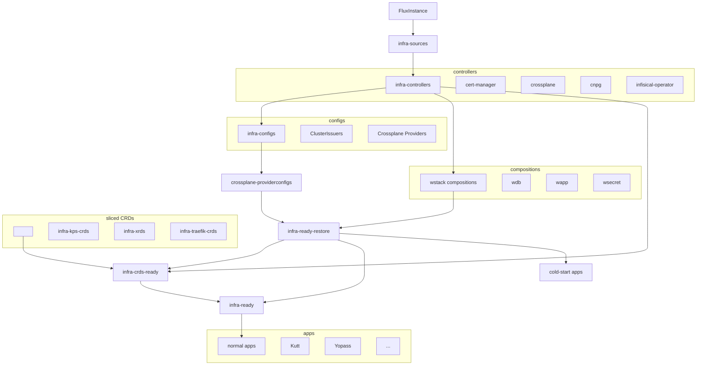

# ArgoCD to Flux






**☝️ Don't miss the other tabs** — overview, components, installation, and my real-world setup.


## Why Consider Migrating?

I've been running [ArgoCD](https://argo-cd.readthedocs.io/) for years, managing 90+ applications across my homelab. It was my first GitOps tool — the UI made onboarding easy and gave great visibility into deployments. So why look elsewhere?

Watching [Scott Rosenberg]() being vehement that ArgoCD is a bad implementation while Flux is the right way to do GitOps got me thinking. This video was the final nail in the coffin:



I had to try it out — especially since I wanted to test the new [Flux Operator Web UI](https://fluxoperator.dev/web-ui/) anyway.

Let's be honest: ArgoCD is the de facto standard GitOps tool. Most tutorials, most blog posts, most job descriptions — it's ArgoCD. But popularity doesn't mean best implementation. Even Flux v1 was flawed, which is why [Stefan Prodan](https://www.linkedin.com/in/stefanprodan/) decided to rewrite it from scratch — and Flux v2 was born. It's actively maintained, a CNCF graduated project, and has a [large adopters base](https://fluxcd.io/adopters/) — including [Adore Me](https://www.adoreme.com/), who also sponsor [Cloud Native Bucharest](https://www.meetup.com/cloud-native-bucharest/).

I like rooting for the underdog.

---

## The Problem with ArgoCD

### Sync Fails and ArgoCD Gives Up

ArgoCD's synchronization model has a fundamental flaw: when a sync fails, it stops trying. It marks the application as "Sync Failed" and waits — even if a newer commit exists that would fix the problem.

Consider this scenario:
1. You push a commit that creates a CustomResource
2. The CRD doesn't exist yet — sync fails
3. You push another commit that adds the CRD
4. ArgoCD keeps retrying the *old* failed commit instead of syncing the *newer* fix

This violates GitOps expectations. The latest commit should be the desired state, but ArgoCD gets stuck on the past.

Flux takes a different approach: **eventual consistency**. It continuously reconciles toward the desired state, retrying until it succeeds. If something is temporarily broken, Flux keeps trying. When the dependency becomes available, it converges automatically.

Even [Viktor Farcic]() — a self-proclaimed ArgoCD fan — acknowledges this problem:



*"Argo CD Synchronization is BROKEN!" — Viktor argues ArgoCD's strong consistency model causes more problems than it solves, and eventual consistency (like Flux) would be a game-changer.*

### Helm Charts Aren't Really Helm

ArgoCD doesn't actually install Helm charts — it runs `helm template` to render manifests, then applies them with `kubectl apply`. The Helm release never exists.

This means:
- **`helm list` shows nothing** — Your releases are invisible to Helm tooling
- **Helm hooks don't work properly** — ArgoCD maps them to its own hook system, but many concepts don't translate (no install vs upgrade differentiation)
- **No native rollback** — You can't use `helm rollback`; you're stuck with ArgoCD's mechanisms
- **Drift with generated values** — Charts that generate random passwords or certificates show constant "OutOfSync" because each `helm template` produces different output

Flux uses the native Helm SDK — it actually runs `helm install` and `helm upgrade`. Your releases appear in `helm list`, hooks work as expected, and you get full Helm functionality.

| Feature | ArgoCD | Flux |
|---------|--------|------|
| Method | `helm template` → `kubectl apply` | Native Helm SDK |
| Visible in `helm list` | No | Yes |
| Full Helm hooks | Limited | Yes |
| Native rollback | No | Yes |

### Git Isn't Always the Source of Truth

The core GitOps principle: **Git is the single source of truth**. But with ArgoCD, that's not always the case:

- **UI modifications** — You can change settings, trigger syncs, and even modify application configs through the ArgoCD UI. These changes don't come from Git.
- **Manual syncs** — The "Sync" button is convenient, but it means someone can deploy without committing anything.
- **Parameters and overrides** — ArgoCD lets you override values at the application level, bypassing what's in Git.

The result? Your cluster state can drift from what's in your repository. Git says one thing, the cluster says another, and you're not sure which is "correct."

### RBAC Bypass

ArgoCD creates its own access control layer on top of Kubernetes RBAC. Users can perform actions through the ArgoCD UI that they wouldn't be allowed to do directly in the cluster. This is a security gap — you now have two permission systems to manage, and they can conflict.

Flux delegates entirely to Kubernetes RBAC. No separate access model, no UI actions bypassing cluster permissions.

### "GitOps Is Not for Secrets"

ArgoCD's own documentation states that GitOps isn't suitable for secrets, pushing you toward external vault solutions. This fragments your source of truth — most resources come from Git, but secrets come from elsewhere.

Flux integrates [SOPS](https://github.com/getsops/sops) natively. Encrypted secrets live in Git alongside everything else. One source of truth, fully auditable, no external dependencies.

**My approach:** I use [Infisical](https://infisical.com/) for runtime secrets — the operator syncs secrets from Infisical to Kubernetes. But there's a chicken-and-egg problem: on a fresh cluster, Flux needs credentials to pull from Git, and the Infisical operator needs credentials to authenticate. SOPS solves this — bootstrap secrets (git credentials, registry credentials, Infisical machine identity) are encrypted in Git. Flux decrypts them on startup, Infisical operator comes up, and from there Infisical manages everything else.

### Security: Architecture Matters

ArgoCD has a monolithic architecture with a centralized API server and repo-server. This creates a larger attack surface — and the CVE history shows it.

**Recent critical vulnerabilities:**
- [**CVE-2025-55190**](https://nvd.nist.gov/vuln/detail/CVE-2025-55190) (CVSS 10.0) — Project API token exposes repository credentials
- [**CVE-2024-31989**](https://nvd.nist.gov/vuln/detail/CVE-2024-31989) (CVSS 9.0) — Redis exploit enables privilege escalation to cluster takeover
- [**CVE-2024-29893**](https://nvd.nist.gov/vuln/detail/cve-2024-29893) — Repo-server DoS via malicious Helm registry
- Multiple XSS, authorization bypass, and credential exposure vulnerabilities throughout 2024-2025

The repo-server component is a recurring weak point — it's a [well-documented source of critical CVEs](https://rawkode.academy/read/fluxcd-the-inevitable-choice/).

Flux's architecture is fundamentally different: discrete, single-purpose controllers that mirror Kubernetes' own design. Each controller has minimal permissions for its specific function. This compartmentalized approach creates a smaller attack surface and provides failure isolation — a vulnerability in one component doesn't compromise the entire system.

### Not Truly Pull-Based

ArgoCD runs in your cluster and *pulls* from Git — that's the "pull-based" GitOps model. But it also exposes an API and UI that allow *pushing* changes directly. It's a hybrid that breaks the purity of the model.

---

## Why Flux?

[Flux](https://fluxcd.io/) takes a stricter approach to GitOps.

### Admission Controller Mutations Just Work

With Flux, you don't have to create special rules for each mutation made by admission controllers. ArgoCD constantly shows "OutOfSync" when Kyverno mutates resources (adding labels, defaults, security contexts) — requiring explicit `ignoreDifferences` rules for each mutation type. Flux handles this gracefully by comparing against the actual desired state, not the pre-mutation manifest.

Reference: [gitops-kyverno](https://github.com/stefanprodan/gitops-kyverno)

| Aspect | ArgoCD | Flux |
|--------|--------|------|
| Source of truth | Git + UI + API | Git only |
| UI | Built-in web UI | None (CLI + optional external UIs) |
| Manual interventions | Easy via UI | Requires Git commits |
| Architecture | Centralized application server | Distributed Kubernetes controllers |
| Drift handling | Detects and can auto-heal | Reconciles by default |

### Git Is Actually the Source of Truth

With Flux, there's no UI to make ad-hoc changes. Want to deploy? Commit to Git. Want to rollback? Revert in Git. Want to change a setting? Update Git. Every change is tracked, auditable, and versioned.

### Kubernetes-Native

Flux runs as a set of controllers using Kubernetes-native patterns. It feels like part of the cluster rather than an application running on top of it.

### Lightweight

Flux is significantly lighter on resources than ArgoCD. Each Flux controller has a 64Mi memory request — four controllers total. ArgoCD runs multiple components including an API server, repo-server, Redis, and Dex.

The real difference shows at scale: ArgoCD keeps a full graph of every application and its resources in memory. The more objects your cluster has, the more memory ArgoCD needs. I've had to bump the ArgoCD application controller to 4GB for what wasn't even a large deployment — that was unexpected.

Flux avoids this by design — each controller only tracks its own resource type, no centralized cache. Both tools can handle thousands of applications, but Flux gets there with a fraction of the resources.

### Fast. Really Fast.

Flux is *fast*. Without dependencies, it's lightning fast — resources reconcile almost instantly after a git push.

But what about dependency chains? If app B depends on app A, does B wait for A's full interval before checking? **No.** Flux has a `--requeue-dependency` flag that controls how often blocked resources re-check if their dependencies are ready. Default is 30s — with 5s, you're checking 6x more frequently.

With the Flux Operator, you can tune this via `cluster.size`:

| Size | Concurrent Reconciliations | Requeue Dependency |
|------|---------------------------|-------------------|
| `small` (default) | 5 | 10s |
| `medium` | 10 | 5s |
| `large` | 20 | 5s |

```yaml
apiVersion: fluxcd.controlplane.io/v1
kind: FluxInstance
spec:
  cluster:
    size: medium  # 10 concurrent, 5s requeue
```

### Dependencies with `dependsOn`

Both Kustomizations and HelmReleases support `dependsOn`, letting you define deployment order:

```yaml
apiVersion: kustomize.toolkit.fluxcd.io/v1
kind: Kustomization
metadata:
  name: my-app
spec:
  dependsOn:
    - name: database
    - name: secrets
```

This is cleaner than ArgoCD's sync waves for managing deployment dependencies.

---

## What About the UI?

The biggest ArgoCD advantage is the UI — visualizing application state, seeing sync status at a glance, clicking through resources. Flux traditionally has none.

But that's changing. I'm curious to try [Flux Operator Web UI](https://fluxoperator.dev/web-ui/) — a new web interface for Flux that could bridge that gap.

## ResourceSet: Templating I Want to Explore

Flux Operator includes [ResourceSet](https://fluxoperator.dev/docs/crd/resourceset/) — a declarative API for generating Kubernetes resources through templating. It caught my attention because it feels conceptually similar to Crossplane Compositions.

| Feature | ResourceSet | Crossplane Compositions |
|---------|-------------|------------------------|
| Purpose | Generate K8s resources from templates + inputs | Generate K8s resources from claims + compositions |
| Templating | Go text templates (`<< inputs.name >>`) | KCL, Go templates, or patch-and-transform |
| Input sources | Static, ConfigMaps, Secrets, GitHub/GitLab | Claims (XR) with schemas |
| Multi-tenant | ServiceAccount-based RBAC | Namespace isolation, RBAC |
| Drift detection | Yes | Yes (via provider reconciliation) |

This could complement Crossplane rather than replace it: Crossplane for infrastructure abstraction (databases, cloud resources), ResourceSet for application templating patterns. Something to explore.

---

## Already Using Hub-and-Spoke?

If you're running ArgoCD in a hub-and-spoke pattern (central cluster managing multiple targets), Flux supports this model too via [flux2-hub-spoke-example](https://github.com/fluxcd/flux2-hub-spoke-example).

However, **Flux recommends standalone mode** (Flux per cluster) for most use cases. From [Stefan Prodan's multi-cluster guide](https://stefanprodan.com/blog/2024/fluxcd-multi-cluster-architecture/):

> "Running Flux in the standalone mode offers a higher degree of security and autonomy for the clusters."

| Mode | Pros | Cons |
|------|------|------|
| **Standalone** (recommended) | Reduced attack surface, no SPOF, test upgrades per-cluster | Operational overhead for bootstrapping |
| **Hub-and-Spoke** | Single pane of glass, less bootstrap overhead | SPOF, security risk, network complexity |

**When hub-and-spoke makes sense:**
- **Cluster API users** — The Flux hub doubles as your CAPI management cluster
- **Dev/ephemeral environments** — Lower security requirements, operational simplicity matters more
- **Migration path** — Keep your existing pattern while transitioning from ArgoCD

**Flux 2.7 improvement:** [Workload identity support](https://fluxcd.io/blog/2025/09/flux-v2.7.0/) for authenticating to spoke clusters using cloud identities (AWS EKS, Azure AKS, GCP GKE) — no more static kubeconfig secrets.

---

## Credit Where It's Due

When I started learning Kubernetes, ArgoCD made it easy to understand GitOps visually. Seeing applications, their sync status, the resource tree — it clicked. And it's the same for developers starting their journey with Kubernetes and GitOps today. The UI is genuinely valuable for learning and day-to-day visibility.

Another thing I miss: ArgoCD can sync a single resource. Flux reconciles at the Kustomization or HelmRelease level, so you always trigger a group of resources, not just the one you care about.

So why not have both? Flux for infrastructure (where correctness and security matter most), ArgoCD for developer-facing applications (where the UI helps teams understand what's deployed). It's not all-or-nothing.





## Flux Controllers

Flux is built as a set of specialized Kubernetes controllers, each handling a specific concern. This mirrors Kubernetes' own architecture — small, focused components that do one thing well.



### Source Controller

Fetches artifacts from external sources and makes them available to other controllers.

| Resource | Purpose | Example |
|----------|---------|---------|
| **GitRepository** | Tracks a Git repo, fetches on changes | Your flux monorepo |
| **HelmRepository** | Tracks a Helm chart repository (HTTP) | Bitnami, Jetstack |
| **OCIRepository** | Tracks OCI artifacts (Helm charts, containers) | Harbor OCI, ghcr.io, Docker Hub |
| **Bucket** | Tracks S3-compatible buckets | MinIO, AWS S3 |

```yaml
# Example: OCIRepository for a Helm chart from Harbor
apiVersion: source.toolkit.fluxcd.io/v1
kind: OCIRepository
metadata:
  name: harbor-repl-traefik
  namespace: flux-system
spec:
  interval: 10m
  url: oci://my-registry.example.com/repl-traefik/helm/traefik
  ref:
    tag: "39.0.1"
  layerSelector:
    mediaType: application/vnd.cncf.helm.chart.content.v1.tar+gzip
```


**OCIRepository vs HelmRepository (type: oci)**: The legacy pattern used `HelmRepository` with `type: oci`, but the modern approach uses `OCIRepository` + `chartRef` on HelmReleases. This supports Cosign signature verification, semver policies, and `layerSelector` for charts with provenance layers.


### Kustomize Controller

Reconciles Kustomization resources — applies manifests from a source with optional Kustomize overlays.

**Key features:**
- Applies raw YAML manifests or Kustomize overlays
- Health checking with `wait: true`
- Dependency ordering with `dependsOn`
- Pruning of removed resources with `prune: true`
- Variable substitution from ConfigMaps/Secrets

```yaml
apiVersion: kustomize.toolkit.fluxcd.io/v1
kind: Kustomization
metadata:
  name: apps
  namespace: flux-system
spec:
  interval: 10m
  timeout: 5m
  retryInterval: 1m
  dependsOn:
    - name: infra-configs    # Wait for infrastructure first
  path: ./apps/k8s-blue-cc
  prune: true                # Delete resources removed from git
  wait: true                 # Wait for resources to be healthy
  sourceRef:
    kind: GitRepository
    name: flux-system
```


**Kustomization vs kustomization.yaml**: The Flux `Kustomization` CRD (capital K) is different from Kustomize's `kustomization.yaml` file. Flux Kustomizations *can* apply Kustomize overlays, but they can also apply plain YAML directories.


### Helm Controller

Manages HelmRelease resources — declarative Helm chart installations using the native Helm SDK.

**Key features:**
- Native `helm install` / `helm upgrade` (visible in `helm list`)
- Full Helm hooks support
- Values from ConfigMaps, Secrets, or inline
- Post-renderers for Kustomize patches
- Automatic rollback on failure

```yaml
apiVersion: helm.toolkit.fluxcd.io/v2
kind: HelmRelease
metadata:
  name: my-app
  namespace: my-app
spec:
  interval: 10m
  chartRef:
    kind: OCIRepository
    name: my-app
    namespace: flux-system
  values:
    replicas: 2
    ingress:
      enabled: true
```


**chartRef vs chart.spec.sourceRef**: With `chartRef`, the chart version is pinned in the `OCIRepository` source (via `ref.tag`), not in the HelmRelease. This keeps version management in one place and lets Renovate update versions by editing the source file.


### Notification Controller

Handles alerts and webhooks — both outgoing notifications and incoming triggers.

| Resource | Direction | Purpose |
|----------|-----------|---------|
| **Provider** | Outbound | Where to send notifications (Slack, Teams, etc.) |
| **Alert** | Outbound | What events trigger notifications |
| **Receiver** | Inbound | Webhook endpoint for external triggers (GitHub, Forgejo) |

```yaml
# Alert on sync failures
apiVersion: notification.toolkit.fluxcd.io/v1beta3
kind: Alert
metadata:
  name: flux-errors
  namespace: flux-system
spec:
  providerRef:
    name: slack
  eventSeverity: error
  eventSources:
    - kind: Kustomization
      name: '*'
    - kind: HelmRelease
      name: '*'
```

---

## Core Concepts

### Reconciliation Loop

Every Flux resource has an `interval` that defines how often it reconciles:

```yaml
spec:
  interval: 10m      # Check every 10 minutes
  timeout: 5m        # Fail if not done in 5 minutes
  retryInterval: 1m  # On failure, retry every minute
```

Unlike ArgoCD's "sync once and stop on failure", Flux continuously reconciles until the desired state is reached.

### Dependency Ordering

Use `dependsOn` to ensure resources deploy in order:

```yaml
spec:
  dependsOn:
    - name: cert-manager      # Wait for cert-manager
    - name: external-secrets  # Wait for external-secrets
```

This replaces ArgoCD's sync waves with explicit, readable dependencies.

### Health Checking

With `wait: true`, Flux waits for resources to be healthy before marking reconciliation complete:

```yaml
spec:
  wait: true          # Wait for all resources to be Ready
  healthChecks:       # Or specify custom health checks
    - apiVersion: apps/v1
      kind: Deployment
      name: my-app
      namespace: my-app
```

### Pruning

With `prune: true`, Flux deletes resources that are removed from Git:

```yaml
spec:
  prune: true
```

This ensures your cluster matches Git exactly — no orphaned resources.





## Installation Options

There are two ways to install Flux:

| Method | Best For | Pros | Cons |
|--------|----------|------|------|
| **`flux bootstrap`** | Quick start, learning | Simple CLI command | Manual upgrades, scattered config |
| **Flux Operator** | Production, GitOps-managed Flux | Auto-upgrades, single CRD | Slightly more setup |

I use the **Flux Operator** because it manages Flux itself via GitOps — upgrades happen automatically when I bump the version.

---

## Flux Operator Installation

### Prerequisites

- Kubernetes cluster
- `kubectl` configured
- `helm` v3 installed
- Git credentials for your repo

### Step 1: Install the Operator

```bash
helm install flux-operator oci://ghcr.io/controlplaneio-fluxcd/charts/flux-operator \
  --namespace flux-system \
  --create-namespace \
  --wait
```

### Step 2: Create Bootstrap Secrets

Flux needs credentials to pull from your Git repo:

```bash
# Git credentials (HTTPS basic auth)
kubectl create secret generic git-credentials-bootstrap \
  -n flux-system \
  --from-literal=username=flux-bot \
  --from-literal=password="$GIT_TOKEN"

# Registry credentials (if using private OCI registry)
kubectl create secret docker-registry harbor-credentials \
  -n flux-system \
  --docker-server=my-registry.example.com \
  --docker-username=flux \
  --docker-password="$REGISTRY_PASSWORD"
```

### Step 3: Create FluxInstance

The `FluxInstance` CRD is the single source of truth for your Flux installation:

```yaml
apiVersion: fluxcd.controlplane.io/v1
kind: FluxInstance
metadata:
  name: flux
  namespace: flux-system
spec:
  distribution:
    version: "2.x"              # Auto-upgrade to latest 2.x patch
    registry: ghcr.io/fluxcd
  components:
    - source-controller
    - kustomize-controller
    - helm-controller
    - notification-controller
  sync:
    kind: GitRepository
    url: "https://git.example.com/org/flux-repo.git"
    ref: "refs/heads/main"
    path: "clusters/my-cluster"
    pullSecret: "git-credentials-bootstrap"
  cluster:
    domain: cluster.local
```

Apply it:

```bash
kubectl apply -f flux-instance.yaml
```

### Step 4: Verify

```bash
# Check FluxInstance status
kubectl get fluxinstance -n flux-system

# Check all Flux resources
flux get all -A

# Watch reconciliation
flux get kustomizations -A --watch
```

---

## Useful Commands

### Status & Debugging

```bash
# Overview of all Flux resources
flux get all -A

# Check specific resource types
kubectl get kustomizations -n flux-system
kubectl get helmreleases -A
kubectl get gitrepository -n flux-system

# Detailed status
kubectl describe kustomization apps -n flux-system
kubectl describe helmrelease my-app -n my-namespace

# Controller logs
kubectl logs -n flux-system deploy/source-controller
kubectl logs -n flux-system deploy/kustomize-controller
kubectl logs -n flux-system deploy/helm-controller
```

### Force Reconciliation

```bash
# Reconcile git source (pulls latest)
flux reconcile source git flux-system -n flux-system

# Reconcile specific Kustomization
flux reconcile kustomization apps -n flux-system

# Reconcile specific HelmRelease
flux reconcile helmrelease my-app -n my-namespace
```

### Suspend & Resume

```bash
# Suspend (stop reconciling)
flux suspend kustomization apps -n flux-system

# Resume
flux resume kustomization apps -n flux-system
```

### Preview Changes

```bash
# Diff without applying
flux diff kustomization apps -n flux-system

# Show resource tree
flux tree kustomization apps -n flux-system
```

### Troubleshooting

```bash
# Recent events
kubectl get events -n flux-system --sort-by='.lastTimestamp' | tail -20

# Check why something failed
flux logs --level=error

# Export current state (for debugging)
flux export source git flux-system -n flux-system
flux export kustomization apps -n flux-system
```





## My Repository Structure

I follow the [Flux monorepo best practice](https://fluxcd.io/flux/guides/repository-structure/) — one repository for the entire cluster state:

```
flux-repo/
├── clusters/
│   ├── base/                         # Shared Flux Kustomization definitions
│   │   ├── infrastructure/           # Kustomizations for infra components
│   │   │   ├── kustomization.yaml
│   │   │   ├── sources.yaml          # → infrastructure/sources
│   │   │   ├── cert-manager.yaml     # → infrastructure/controllers/cert-manager
│   │   │   ├── crossplane.yaml       # → infrastructure/controllers/crossplane
│   │   │   ├── cnpg.yaml             # → infrastructure/controllers/cnpg
│   │   │   ├── configs.yaml          # → infrastructure/configs
│   │   │   ├── crossplane-*.yaml     # → wstack compositions
│   │   │   ├── infra-ready.yaml      # Gate for apps (depends on all above)
│   │   │   └── ready/                # Empty kustomization for gate
│   │   └── apps/                     # Kustomizations for apps
│   │       ├── kustomization.yaml
│   │       └── *.yaml                # Per-app Flux Kustomizations
│   ├── k8s-blue-cc/                  # Blue cluster entry point
│   │   ├── kustomization.yaml        # Controls what flux-system applies
│   │   ├── flux-instance.yaml        # FluxInstance CRD
│   │   ├── bootstrap.yaml            # Kustomization for bootstrap secrets
│   │   ├── bootstrap/                # SOPS-encrypted secrets (separate build)
│   │   │   └── bootstrap-secrets.sops.yaml
│   │   ├── infrastructure.yaml       # Points to base/infrastructure
│   │   ├── apps.yaml                 # Points to base/apps
│   │   └── cluster-vars/             # Cluster-specific ConfigMap
│   └── k8s-green-cc/                 # Green cluster entry point
│       └── ...
│
├── infrastructure/
│   ├── sources/                      # OCIRepositories (62) + HelmRepositories (2 HTTP-only)
│   ├── controllers/                  # Operator installations
│   │   ├── cert-manager/             # HelmRelease, namespace, dashboards
│   │   ├── crossplane/
│   │   ├── cnpg/
│   │   └── infisical-operator/
│   └── configs/                      # Resources needing controller CRDs
│       ├── cluster-issuers.yaml      # Needs cert-manager
│       ├── crossplane-providers.yaml # Needs crossplane
│       ├── crossplane-providerconfigs/
│       └── crossplane-rbac/
│
├── apps/
│   └── base/                         # App definitions
│       ├── kutt/
│       ├── yopass/
│       └── ...
│
└── prds/                             # Project requirement documents
```

### Why Two Layers?

The structure has two distinct layers:

| Layer | Contains | Purpose |
|-------|----------|---------|
| `clusters/base/` | Flux Kustomization definitions | **What** to deploy, dependencies, ordering |
| `infrastructure/` | Actual manifests (HelmReleases, etc.) | **How** to deploy |

**Example flow:**
1. `clusters/k8s-blue-cc/infrastructure.yaml` → applies `clusters/base/infrastructure/`
2. `clusters/base/infrastructure/cert-manager.yaml` → creates Flux Kustomization pointing to `infrastructure/controllers/cert-manager/`
3. `infrastructure/controllers/cert-manager/` → actual HelmRelease, namespace, dashboards

This allows both clusters to share deployment logic while keeping manifests organized separately.

### The `-pre` / (main) / `-post` Convention

Every controller that needs it is split into up to three sibling Flux Kustomizations:

| Suffix | What lives here | Why |
|--------|-----------------|-----|
| `infra-<x>-pre` | Secrets/ConfigMaps the HelmRelease references **by name** at install time (`existingSecret`, `envFrom.secretRef`, etc.) materialized by Crossplane/Infisical | The HR's Helm `--wait` blocks on Pod Ready, which blocks on the Secret existing. Without a `-pre` gate, cold-start deadlocks |
| `infra-<x>` | The HelmRelease itself + anything that fits in the same SSA pass | The chart install |
| `infra-<x>-post` | CRs whose CRD isn't owned by this controller (PrometheusRule, ServiceMonitor, Middleware, VPA) + anything that needs the controller's Pods up (e.g., admission webhooks serving) | Applying these before the HR is Ready fails with CRD-not-found or webhook-rejected |

Every `VerticalPodAutoscaler` lives in `-post/` because `infra-vpa` owns the CRD. **A bootstrap-deps lint (`scripts/check-bootstrap-deps.sh`, wired into a pre-commit hook and a Forgejo Actions workflow) enforces this**: every Secret-by-name reference in a HelmRelease has to resolve to a `-pre` sibling, a seeded bootstrap Secret, or an explicit allowlist entry.

### Slicing CRDs out of slow charts

Some controllers' CRDs are needed by many dependents (`PrometheusRule`, `Middleware`, etc.) but the controller's chart install is slow — kube-prometheus-stack on cold-start can take 10+ minutes for chart pull, dry-run, helm install, and Pod Ready. Forcing every dependent that just needs the `monitoring.coreos.com` CRDs to wait for the whole HR is a critical-path bottleneck.

The fix is to apply the CRDs in a separate fast Kustomization that joins `infra-crds-ready` directly, leaving the controller HR (which `infra-crds-ready` does NOT wait on) free to take its time. Three patterns, in order of preference:

**1. First-party companion CRDs chart.** kube-prometheus-stack's CRDs are also published as a standalone `prometheus-operator-crds` chart by the same maintainer org. We install it as `infra-kps-crds`, set `crds.enabled: false` on the kube-prometheus-stack HR, and let helm-controller's default take-ownership behaviour adopt the live CRDs into the new release on first reconcile. This is the cleanest split — the upstream maintainer is doing the bookkeeping for us.

**2. Chart-`/crds/`-slice via the same OCIRepository.** Charts whose CRDs live in the chart tarball's `/crds/` directory (traefik is the canonical case) can be sliced without any upstream cooperation: a single `OCIRepository` serves both `chartRef` for the HelmRelease and `sourceRef` for a sibling Flux Kustomization with `path: ./<chart>/crds`. Renovate keeps both consumers locked to the same `tag:`, so chart and CRD versions never drift. Per-CRD `healthChecks` are mandatory (otherwise the slice marks itself Ready before the API server reports the CRDs as Established and dependents race), and the controller HR needs `dependsOn: <slice-name>` so the chart's own templated CRs (`IngressRoute`, `TLSStore`, etc.) find their CRDs at install time:

```yaml
# infra-traefik-crds.yaml — slice from the same OCI artifact the HR uses
apiVersion: kustomize.toolkit.fluxcd.io/v1
kind: Kustomization
spec:
  sourceRef:
    kind: OCIRepository
    name: my-traefik-chart        # also referenced as chartRef by the HR
  path: ./traefik/crds
  prune: false
  wait: true
  healthChecks:
    - apiVersion: apiextensions.k8s.io/v1
      kind: CustomResourceDefinition
      name: ingressroutes.traefik.io
    - apiVersion: apiextensions.k8s.io/v1
      kind: CustomResourceDefinition
      name: middlewares.traefik.io
    # ... one per CRD in the chart
```

**3. Manifest split for CRDs we own.** Crossplane XRDs (`Wsecret`, `Wapp`, `Wdb`, `HarborReplication`) are ours: we restructured each composition's sibling repo to expose `xrds/` and `manifests/` as separate Kustomize bases, then made the composition Kustomization `dependsOn: infra-xrds`. The XRDs apply in seconds; only the slow Composition+Function reconciliation stays on the controller path.

What we explicitly didn't do: static CRD mirrors checked into the Flux repo, or adopting random community "CRDs-only" charts that aren't maintained by the upstream operator's owners. Both go stale silently. The bar is "first-party or first-party-adjacent same-maintainer-org charts only" — patterns 1 and 3 satisfy it directly; pattern 2 satisfies it because the slice and the HR consume the same upstream artifact, just with different `path:` filters.

### Why Separate Controllers from Configs?

Controllers and configs are in separate Flux Kustomizations because of **CRD availability**:

```yaml
# configs.yaml - waits for controllers
dependsOn:
  - name: infra-crossplane    # Need Crossplane CRDs
  - name: infra-cert-manager  # Need cert-manager CRDs
```

**The problem:** You can't deploy a `ClusterIssuer` until cert-manager is running and has registered its CRDs.

**Kustomize ordering isn't enough** — it only controls apply order. Flux's `dependsOn` + `wait: true` actually waits for pods to be **ready** and CRDs to be **registered** before proceeding.

| Approach | What it does | Sufficient? |
|----------|--------------|-------------|
| Kustomize ordering | Apply in order | ❌ No wait for readiness |
| Flux `dependsOn` + `wait: true` | Wait for pods ready, CRDs registered | ✅ Yes |

### Why Monorepo?

| Benefit | Description |
|---------|-------------|
| **Single source of truth** | One repo = one place to see entire cluster state |
| **Atomic changes** | Update multiple apps in one PR |
| **Clear dependencies** | See what depends on what |
| **Simple webhooks** | One webhook triggers everything |
| **Easy onboarding** | Copy a folder to add new app |

### Bootstrap Secrets

SOPS-encrypted secrets in `bootstrap/bootstrap-secrets.sops.yaml` solve the chicken-and-egg problem:

| Secret | Purpose |
|--------|---------|
| `git-credentials-bootstrap` | Flux pulls from private Git repos |
| `harbor-credentials` | Flux pulls Helm charts from private OCI registry |
| `universal-auth-credentials` | Infisical operator authenticates to create other secrets |

The `bootstrap/` subdirectory has its own Flux Kustomization (`bootstrap.yaml`) with SOPS decryption configured — this avoids duplicate resource conflicts with the `infisical-operator` namespace defined elsewhere.

Bootstrap requires only one manual step: create the `flux-sops` secret containing the [age](https://github.com/FiloSottile/age) decryption key. Flux decrypts the rest automatically.

---

## Dependency Chain

My cluster follows this reconciliation order:



Three-tier gate: `infra-ready-restore` is the minimum set that cold-start-critical apps (forgejo, harbor, CNPG, infisical) need to come up before backups can be restored. `infra-crds-ready` is a parallel CRD-readiness aggregator: sliced CRD-only Kustomizations (KPS via the first-party `prometheus-operator-crds` chart, the Crossplane XRDs split out of their composition repos, and traefik via a chart-`/crds/`-slice) sit alongside the slower controllers so dependents that only need a CRD don't wait for the full chart install. `infra-ready` then collapses to a two-edge super-gate (`dependsOn: [infra-ready-restore, infra-crds-ready]`); apps continue to depend only on `infra-ready` and inherit the speedup transparently. This keeps the design compatible with a true cold-start-from-backup scenario — the monitoring/backup stack doesn't have to be green before the apps that restore it can start — and shaves the slowest chart installs (kube-prometheus-stack, traefik) off the CRD-readiness critical path.

This is defined via two files. First, the cluster entry point:

**`clusters/k8s-blue-cc/infrastructure.yaml`** — points to base:
```yaml
apiVersion: kustomize.toolkit.fluxcd.io/v1
kind: Kustomization
metadata:
  name: infrastructure
  namespace: flux-system
spec:
  interval: 10m
  dependsOn:
    - name: cluster-vars
  path: ./clusters/base/infrastructure
  prune: true
  sourceRef:
    kind: GitRepository
    name: flux-system
```

Then, **`clusters/base/infrastructure/`** contains individual Flux Kustomizations:

```yaml
# cert-manager.yaml - controller installation
apiVersion: kustomize.toolkit.fluxcd.io/v1
kind: Kustomization
metadata:
  name: infra-cert-manager
spec:
  dependsOn:
    - name: infra-sources
  path: ./infrastructure/controllers/cert-manager
  wait: true  # Wait for pods ready before dependents proceed
---
# infra-ready-restore.yaml - minimum gate for cold-start-critical apps
apiVersion: kustomize.toolkit.fluxcd.io/v1
kind: Kustomization
metadata:
  name: infra-ready-restore
spec:
  dependsOn:
    - name: crossplane-providerconfigs
    - name: crossplane-wdb
    - name: crossplane-wapp
    - name: crossplane-wsecret
    - name: infra-harbor     # Most pods pull images from Harbor
    - name: infra-traefik    # Apps need ingress
    - name: infra-configs    # ClusterIssuers, priority classes
  path: ./clusters/base/infrastructure/ready
  wait: true
---
# infra-crds-ready.yaml - parallel CRD-readiness aggregator
apiVersion: kustomize.toolkit.fluxcd.io/v1
kind: Kustomization
metadata:
  name: infra-crds-ready
spec:
  dependsOn:
    # Sliced (CRDs only, fast):
    - name: infra-kps-crds       # KPS CRDs via first-party chart
    - name: infra-xrds           # Crossplane XRDs (Wsecret/Wapp/Wdb/Harbor)
    - name: infra-traefik-crds   # Traefik CRDs from chart's /crds/ dir
    # Non-sliced (full HR Ready):
    - name: infra-vpa
    - name: infra-velero
    - name: infra-cnpg
    - name: infra-kyverno
    - name: infra-otel
    - name: infra-infisical-operator
    # ... etc.
  path: ./clusters/base/infrastructure/ready
  wait: true
---
# infra-ready.yaml - super-gate normal apps depend on
apiVersion: kustomize.toolkit.fluxcd.io/v1
kind: Kustomization
metadata:
  name: infra-ready
spec:
  dependsOn:
    - name: infra-ready-restore
    - name: infra-crds-ready
  path: ./clusters/base/infrastructure/ready
  wait: true
```

---

## Example App Structure

Here's how an app looks in my setup (using `kutt` as example):

```
apps/base/kutt/
├── kustomization.yaml    # Lists all resources
├── namespace.yaml        # Namespace definition
├── helmrelease.yaml      # Helm chart deployment
└── manifests/
    ├── wsecret.yaml      # Infisical secret reference
    └── wdb.yaml          # Crossplane database
```

**kustomization.yaml** (Kustomize, not Flux):
```yaml
apiVersion: kustomize.config.k8s.io/v1beta1
kind: Kustomization
resources:
  - namespace.yaml
  - helmrelease.yaml
  - manifests/wsecret.yaml
  - manifests/wdb.yaml
```

**helmrelease.yaml**:
```yaml
apiVersion: helm.toolkit.fluxcd.io/v2
kind: HelmRelease
metadata:
  name: kutt
  namespace: kutt
spec:
  interval: 10m
  driftDetection:
    mode: warn
  chartRef:
    kind: OCIRepository
    name: harbor-repl-kutt
    namespace: flux-system
  values:
    ingress:
      enabled: true
      className: "traefik-public"
    # ... rest of values
```

The chart version (`8.6.0`) is pinned in the OCIRepository source file (`infrastructure/sources/harbor-repl-kutt.yaml`), not in the HelmRelease. Renovate monitors the source file and opens PRs when new versions appear in Harbor.

---

## Webhook Configuration

Instead of polling, I use webhooks for instant reconciliation on git push:

```yaml
# Receiver that listens for Forgejo push events
apiVersion: notification.toolkit.fluxcd.io/v1
kind: Receiver
metadata:
  name: forgejo-receiver
  namespace: flux-system
spec:
  type: generic
  secretRef:
    name: webhook-token
  resources:
    - kind: GitRepository
      name: "*"
      namespace: flux-system
      matchLabels:
        webhook.flux.wxs.io/enabled: "true"
```

The FluxInstance adds the label to the main GitRepository via `commonMetadata`:

```yaml
spec:
  commonMetadata:
    labels:
      webhook.flux.wxs.io/enabled: "true"
```

---

## Multi-Cluster Setup

Both clusters share the same repo but have separate entry points:

| Cluster | Entry Point | Shared Config |
|---------|-------------|---------------|
| k8s-blue-cc | `clusters/k8s-blue-cc/` | `clusters/base/` |
| k8s-green-cc | `clusters/k8s-green-cc/` | `clusters/base/` |

Both clusters:
- Share `clusters/base/` (same Flux Kustomization definitions)
- Share `infrastructure/` (same controllers, sources, configs)
- Share `apps/base/` (same app manifests)
- Have cluster-specific `cluster-vars/` for ConfigMaps (domain, cluster name)
- Reconcile independently





---

## Current Status

**Migration complete.** What started as "let me just try Flux on a few apps to get the taste of it" turned into migrating the entire cluster and decommissioning ArgoCD. Classic.

| Category | Migrated | Status |
|----------|----------|--------|
| **Apps** | 46 apps — kutt, yopass, rxresume, dot-ai, freshrss, nextcloud, vaultwarden, linkwarden, n8n, wikijs, unifi, privatebin, ntfy, certmate, and more | ✅ Complete |
| **Controllers** | 42 controllers — cert-manager, cilium, cnpg, crossplane, flux-operator, forgejo, harbor, infisical, infisical-operator, k10, k8s-cleaner, k8tz, komoplane, kyverno, loki, mariadb-operator, otel, pocket-id, reloader, renovate, rook-ceph, s3bkp, traefik, valkey, velero, vpa, wkps, xlb, and more | ✅ Complete |
| **Configs** | ClusterIssuers, Crossplane providers/RBAC, webhook receiver, web UI, priority classes | ✅ Complete |
| **Compositions** | wdb, wapp, wsecret (Crossplane wstack) | ✅ Complete |
| **Bootstrap** | SOPS-encrypted secrets (git, harbor, infisical credentials) | ✅ Complete |
| **ArgoCD** | Decommissioned | ☠️ Gone |

The migration PRD was 1000+ lines of milestones, research, and detailed tasks. It's done now — and I'm not looking back.

---

## Resources

- [Flux Documentation](https://fluxcd.io/flux/)
- [Flux Operator Documentation](https://fluxcd.control-plane.io/)
- [Flux Operator Web UI](https://fluxoperator.dev/web-ui/) — New web interface for Flux
- [flux2-kustomize-helm-example](https://github.com/fluxcd/flux2-kustomize-helm-example) — Official example repo
- [Repository Structure Guide](https://fluxcd.io/flux/guides/repository-structure/) — Monorepo best practices
- [KRM-Native GitOps: Without Flux There is Nothing](https://www.linkedin.com/pulse/krm-native-gitops-yes-without-flux-fluxcd-nothing-mialon-wsmue/) — Deep technical comparison
- [Flux vs Argo CD Comparison](https://spacelift.io/blog/flux-vs-argo-cd) — Spacelift
- [GitOps Guide: ArgoCD vs Flux](https://www.codereliant.io/p/gitops-guide-argocd-vs-flux) — CodeReliant

### Further Reading

- [Stairway to GitOps: How Morgan Stanley Adopted Flux](https://fluxcd.io/blog/2026/03/stairway-to-gitops-morgan-stanley/) — Morgan Stanley's five-year journey from push-based CI/CD to GitOps with Flux at enterprise scale: 500 clusters, over 2,000 nodes, over 100,000 containers.
- [How I Manage My Kubernetes Cluster With Git](https://www.youtube.com/watch?v=hoi2GzvJUXM) — If you want to find out what a *fluxomization* is, watch this

---

*If you made it this far, scroll back up and check out the other tabs — **Flux Components** covers the controller architecture, **Installation** walks through Flux Operator setup, and **My Setup** shows my actual repository structure and patterns.*

