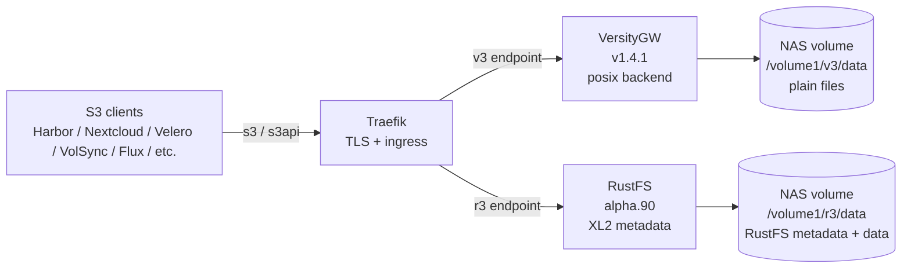

# Leaving MinIO: Garage, VersityGW, and RustFS







**TL;DR**: When MinIO gutted its open-source web UI in May 2025 and then put the OSS repo into maintenance mode at the end of the year, I had to leave. I tried Garage first (single-node behaviour on a Synology NAS was unstable), settled on VersityGW for the bulk of my buckets (POSIX backend, very Synology-friendly), and added RustFS on the side for the buckets VersityGW couldn't host cleanly. Both replacements have rough edges. Maintainers fix things fast, but as of today (2026-05-21) I would still not call my RustFS deployment production-ready, and I keep alpha.90 warm as a rollback target.


## Why MinIO had to go

For years MinIO was the obvious answer for self-hosted S3. Then the rug pull started. The condensed timeline:

- **November 2024**: MinIO Inc. announces [AIStor](https://www.min.io/press/minio-releases-aistor-purpose-built-for-ai-and-data-workloads), a commercial AI-focused product, timed to KubeCon NA 2024 (the Enterprise tier [reportedly starts around $96k/year for up to 400 TiB](https://www.futuriom.com/articles/news/minio-faces-fallout-for-stripping-features-from-web-gui/2025/06)). Clear signal that engineering attention had moved upmarket.
- **May 2025**: MinIO ships [RELEASE.2025-05-24](https://github.com/minio/minio/discussions/21326), which removes account management, policy management, bucket management, lifecycle/tier management, and site replication from the Community Edition web console. The CLI (`mc`) still works, but the admin UI is effectively gutted. The community reaction is loud and unhappy.
- **December 2025**: The `minio/minio` repo goes into [maintenance mode](https://github.com/minio/minio/issues/21715). New features stop. Security fixes are handled case-by-case.
- **February 2026**: README updated to "THIS REPOSITORY IS NO LONGER MAINTAINED". Repo archived.

Independent write-ups: [Blocks & Files](https://blocksandfiles.com/2025/06/19/minio-removes-management-features-from-basic-community-edition-object-storage-code/), [It's FOSS](https://itsfoss.com/news/minio-moves-away-from-open-source/), [Vonng "MinIO is Dead"](https://blog.vonng.com/en/db/minio-is-dead/), and [InfoQ](https://www.infoq.com/news/2025/12/minio-s3-api-alternatives/).

I do not run RustFS or VersityGW because I have strong feelings about open-source purity. I run them because MinIO's trajectory made it a bad bet for a homelab that I want to still be using in three years. The console gutting was the trigger, the maintenance-mode announcement was the confirmation.

## First swap: Garage

I had heard good things about [Garage](https://garagehq.deuxfleurs.fr/) (Rust, AGPLv3, designed for small geo-distributed clusters). On paper it looked perfect for my setup. In practice, running Garage as a single node on a Synology NAS surfaced two problems I never fully diagnosed:

1. Intermittent hangs lasting several minutes, during which both the S3 API and any in-flight transfers stalled. My best guess at the time was that the internal scrub or garbage collection loop was acquiring a lock that blocked client I/O on a single-node deployment. I never proved this conclusively (the logs at the verbosity I was running were not specific enough).
2. CPU spikes that did not always correlate with traffic.

Garage is explicitly designed for multi-node clusters with at least three nodes. Running it as a single node is technically supported but is not the intended use case, and I think this is what bit me. If I had a second Synology box, I would happily try Garage again.

## Second swap: VersityGW

I moved next to [VersityGW](https://github.com/versity/versitygw) (Go, Apache-2.0). The pitch is different: it is not a storage system, it is an **S3 gateway in front of a POSIX filesystem**. On a Synology that I had already provisioned as a giant Btrfs volume, this fits perfectly. No erasure coding layer, no internal scrub loop, just plain files on disk with metadata in IAM directories. Backups are trivial because everything is just files.

It worked well for most of my buckets immediately. The single thing that bit me was [Nextcloud](https://nextcloud.com/), which uses an S3-compatible primary object store. Nextcloud always sends `x-amz-acl: private` on `PutObject`, and VersityGW v1.0–v1.2 responded with `501 NotImplemented`. Every upload failed, including thumbnails and chunked file writes. I filed [versitygw#1904](https://github.com/versity/versitygw/issues/1904) with the repro; PR [#1875](https://github.com/versity/versitygw/pull/1875) added an opt-in `--disable-acl` flag in v1.3.0, and [#1911](https://github.com/versity/versitygw/pull/1911) made "ignore unsupported ACL headers" the default behaviour shortly after. Today on v1.4.1 the issue is gone.

In the same period I tried hosting [Harbor](https://goharbor.io/) (my container registry) on VersityGW too. That ran into its own pile of S3-protocol edge cases around blob finalization, which I never traced to specific commits. Harbor is sensitive to nuances in how `CompleteMultipartUpload`, `HeadObject`, and signed-URL `GetObject` are implemented, and VersityGW's posix backend was tripping on one or more of those. Rather than file a series of issues against VersityGW for Harbor compatibility, I parked Harbor on a separate backend.

## Third addition: RustFS for Harbor and Nextcloud

[RustFS](https://github.com/rustfs/rustfs) (Rust, Apache-2.0) is the project that markets itself most explicitly as a drop-in MinIO replacement. The admin API shape and the `mc` client (renamed `mcli` locally to avoid colliding with Midnight Commander) are familiar from MinIO. The on-disk format is not the same, so a live MinIO-to-RustFS data migration is not a tarball copy, but the S3-API surface and the day-to-day operator UX is close enough that the muscle memory transfers. So when I needed a second S3 endpoint for the two services VersityGW could not reliably host, RustFS was the obvious choice.

So today I run **two S3 backends on the same Synology**, fronted by Traefik with separate ingresses:

- **VersityGW** for backup buckets, document storage, certificate caches, registry mirrors that work fine with a POSIX backend, and most everything else. About 20 buckets.
- **RustFS** for Harbor (the container registry's blob store), Nextcloud (with the `x-amz-acl` legacy bucket on this side too), a `public` bucket with anonymous read for static assets, and three flavours of Kubernetes backup buckets ([s3bkp](/migrations/s3bkp-to-volsync/) blue/green/citest, VolSync blue/green). About 9 buckets.

Both have intermittent issues. Both have responsive maintainers who fix things fast. Neither is what I would call boring infrastructure yet.

## Every issue I have hit or filed

The full list, mostly so I can find it later when something breaks again.

### RustFS

| Upstream issue | Symptom | Resolution |
|---|---|---|
| [rustfs#1838](https://github.com/rustfs/rustfs/issues/1838) | x86_64 Docker image SIGILLs with exit 132 on launch | The binary was compiled with AVX-requiring instructions but no runtime CPU feature check. The Intel Celeron J4125 in my Synology DS920+ does not have AVX, so RustFS crashed before `main()`. Maintainer fixed it; current builds work on no-AVX CPUs. |
| [rustfs#2047](https://github.com/rustfs/rustfs/issues/2047), [#2036](https://github.com/rustfs/rustfs/issues/2036) | alpha.84 IAM regression: admin API returned "bucket does not exist", every IAM user got 403 AccessDenied | Downgrade to alpha.80, then upgrade to alpha.90 once fixed. |
| [rustfs#2457](https://github.com/rustfs/rustfs/issues/2457) | alpha.91 broke signed-URL `GetObject` with HTTP 502 BadGateway after ~5s. Harbor 500ed on every blob pull, Flux OCIRepository reconciles failed. | Fixed in alpha.92 via PR #2472. |
| [rustfs#2497](https://github.com/rustfs/rustfs/issues/2497) | alpha.93 went unresponsive after ~24h with `s3aws: InternalError: Io error: put_object_part write size < data.size(), w_size=0`. Health endpoint still returned ok. Every multipart PUT silently wrote zero bytes. | Roll back to alpha.90. |
| [rustfs#2587](https://github.com/rustfs/rustfs/issues/2587) | On alpha.94, with `RUSTFS_SERVER_DOMAINS` set, RustFS fails to start: logs freeze at `Starting: /usr/bin/rustfs /data`, `admin info` reports 0/1 drives online, IAM never loads, Harbor 500s on every OCI pull with `InvalidAccessKeyId`. | Roll back to alpha.90. |
| [rustfs#2601](https://github.com/rustfs/rustfs/issues/2601) | alpha.95 single-node deployments enter a `FaultyDisk` / erasure-read-quorum state immediately on first write, S3 returns 500 across the board. | Roll back to alpha.90. |
| alpha.96 `.usage.json` corruption | After running on alpha.96 for ~24h with a transient drive state change, both `.usage.json` and `.usage.json.bkp` XL objects became unreadable. Every restart afterward reported `Storage resources insufficient` and listed zero buckets. Persisted across upgrades. | Quarantine both objects on disk, restart. RustFS regenerates them on demand. Bucket data is fine, only the top-level usage manifest was corrupt. |
| [rustfs#3028](https://github.com/rustfs/rustfs/issues/3028) | Upgrade to beta.4 on 2026-05-21 made every multipart-uploaded blob in the Harbor bucket return `Io error: encrypted object metadata is incomplete`. CI broke on a 93 MB Trivy DB pull within an hour. **I do not run server-side encryption**: the upstream report scoped this to SSE objects, but my reproducer showed it hits plain multipart objects too (any blob whose S3 ETag has the `-N` suffix). | Rolled back to alpha.90 the same afternoon. Posted the broader-scope reproducer on the issue. |

There are other RustFS issues and PRs I monitor on every release ([#2761](https://github.com/rustfs/rustfs/issues/2761) Harbor push 500 on finalize, open; [#2807](https://github.com/rustfs/rustfs/issues/2807) `.usage.json` read-quorum chain, closed in May 2026 but worth watching for recurrence; [#2790](https://github.com/rustfs/rustfs/issues/2790) network FS scanner hang, open and unlikely to be fixed; [#2996](https://github.com/rustfs/rustfs/pull/2996) scanner-timeout hardening PR, merged; [#3031](https://github.com/rustfs/rustfs/issues/3031) multipart-put write `Storage resources insufficient`, open). I keep a per-version verdict table in a [local skill](/ai-stuff/co-authored-with-ai/) so that "should I take the Renovate bump?" has an answer that does not depend on me remembering anything.

### VersityGW

| Upstream issue | Symptom | Resolution |
|---|---|---|
| [versitygw#1904](https://github.com/versity/versitygw/issues/1904) | `PutObject` returned `501 NotImplemented` whenever the client sent `x-amz-acl`. Nextcloud broke on every upload. | PR [#1875](https://github.com/versity/versitygw/pull/1875) added `--disable-acl` in v1.3.0; PR [#1911](https://github.com/versity/versitygw/pull/1911) made the silent-ignore behaviour default. Resolved on v1.4.x. |

VersityGW's other gotcha for me has been keeping the admin endpoint behind its own ingress with separate auth, because the admin API has full root authority and the public S3 endpoint should never see those calls. Once that was wired up, the system has been quiet.

### Garage

No upstream issues filed. The hangs I saw on single-node Synology never produced a reproducer clean enough to send to the maintainers. If a second NAS shows up in the homelab I will revisit Garage on three nodes and find out whether the multi-node deployment model fixes what I saw.

## So is this production-ready?

If "production-ready" means "I can let it run for months and not look at it", then **VersityGW don't really know, maybe? RustFS no, both honest answers**.

VersityGW's posix backend is conceptually simple enough that the worst case is "files on disk that any other S3 implementation could also serve". For backup, document storage, and registry mirrors that is the right shape.

RustFS is younger, in active development, and ships breaking changes inside the same minor-version series. Every Renovate bump is an event that needs a person reading the changelog, cross-referencing open issues against my own logs, and deciding whether to upgrade, hold, or roll back. The good news is that the maintainers are responsive and fixes do land within days. The bad news is that the load-bearing part of my Harbor registry is still on software where I rolled back inside an hour today. I keep alpha.90 warm.

I would not recommend this exact split to someone setting up a homelab from scratch in May 2026. I would tell them to put everything they can on a POSIX-backed S3 gateway, and only reach for a young storage system when they have a concrete reason to. For me, the concrete reason was Harbor's protocol expectations and Nextcloud's metadata appetite, and even those I keep meaning to retest against VersityGW now that the ACL issue is fixed.

The deeper-tech view (bucket layout, endpoints, what runs where) is in the **Technical Deep Dive** tab.





## Topology

Both backends run as Docker containers on the same Synology NAS, with Traefik (running upstream on the Kubernetes cluster) handling TLS, virtual-host routing, and middleware. The data and IAM directories live directly on the NAS's Btrfs volumes.



Two endpoints, two backends, one box. The split keeps blast radius small: if RustFS misbehaves, only the buckets that need its specific behaviour go down. The 20 buckets on VersityGW keep working. For where this slots into the broader homelab, see [The Stack](/infrastructure/the-stack/).

## Bucket-to-backend map

| Bucket | Backend | Why this side |
|---|---|---|
| `harbor` | RustFS | Harbor's blob protocol expectations were difficult on VersityGW's posix backend. |
| `nextcloud` | RustFS | Historical; the `x-amz-acl` issue on VersityGW pushed Nextcloud here. Now fixed upstream, untested move-back. |
| `public` | RustFS | Anonymous-read bucket policy for static assets. |
| `s3bkp-{blue,green,citest}` | RustFS | Live with the cluster's existing tooling; was already there when I migrated. |
| `volsync-{blue,green}` | RustFS | Same as above. |
| `transfer` | RustFS | Same as above. |
| `forgejo`, `forgejo-backup` | VersityGW | Git server data + backup. Posix backend = trivial recovery. |
| `pgbackweb`, `cnpg-bkp-{blue,green}` | VersityGW | Postgres backups. Streaming uploads, plain files, no surprises. |
| `velero-{blue,green}`, `k10-{blue,green}` | VersityGW | Cluster-level backups. |
| `letsenc`, `pocket-id`, `rxresume`, `linkwarden`, `docs`, `iso`, `terraform`, etc. | VersityGW | Document storage, certificate caches, registry mirrors. |

The split is operational, not architectural. I will gladly consolidate down to one backend the moment one of them earns it.

## Endpoints

| Service | URL | Notes |
|---|---|---|
| VersityGW S3 API | `https://v3.example.com` | Path-style and virtual-hosted-style (the `VGW_VIRTUAL_DOMAIN` is `.v3.example.com`). |
| VersityGW admin API | `https://v3admin.example.com` | Separate ingress, separate auth. Only the laptop's `versitygw admin` CLI touches this. |
| VersityGW WebUI | `https://v3ui.example.com` | Exposed via Traefik with CORS middleware. Useful for ad-hoc bucket browsing without needing the CLI. |
| RustFS S3 API | `https://r3.example.com` | Standard S3 v4 sigv4. |
| RustFS Console | Internal only | Port 9001 on the container. Not exposed; `mcli admin` from the laptop handles everything. |

In code examples below, replace `example.com` with your own domain.

## Operating both at once

The day-to-day commands I run most often:

```bash
# List buckets on each
mcli ls r3/
aws s3api --endpoint-url https://v3.example.com --region us-east-1 list-buckets

# Health on each
mcli admin info r3 --json | jq '{mode: .info.mode, buckets: .info.buckets, objects: .info.objects.count}'
curl -s https://v3.example.com/health

# Copy between backends (e.g., when migrating a bucket from one to the other)
mcli mirror --watch --remove r3/<bucket>/ vgw/<bucket>/

# IAM user management
mcli admin user list r3
versitygw admin -er https://v3admin.example.com list-users
```

I never SSH to the NAS for storage operations. Everything is admin-API or S3-API from the laptop. The NAS is the data plane; the control plane is here.

## Where this might go next

A few directions I am thinking about:

1. **Retest Nextcloud on VersityGW** now that `x-amz-acl` is silently ignored. If it works, I drop one bucket off RustFS and the blast radius shrinks.
2. **Retest Harbor on VersityGW** once one of the open Harbor-shaped RustFS issues (#2761 / #3031 / #3028) settles upstream and I have a quieter base to compare against. If VersityGW v1.4.x handles Harbor's protocol now, I could collapse to a single backend.
3. **Add a second Synology** (a real DS-class box, not a single-node hack) and reconsider Garage in its native three-node configuration.
4. **Move backups offsite** so that the NAS being down does not also mean the backups are down. Currently it does, which is the worst part of this whole setup.

For now: two backends, one box, alpha.90 warm, beta.4 watched. The journey off MinIO is over, the storage story is not.





