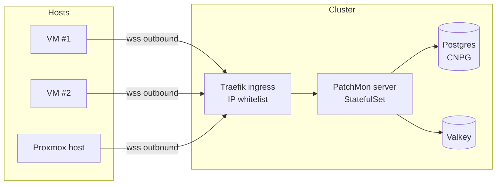

# Centralized Linux patch monitoring with PatchMon



**TL;DR**: I had no central view of pending patches across my small fleet of VMs and Proxmox hosts. I self-hosted [PatchMon](https://patchmon.net) on Kubernetes and wrote a small Ansible role that auto-enrolls each host. Every pending update now shows up in one dashboard, and PatchMon V2 also applies them on demand, so I can approve and push patches from the same place instead of just watching them pile up. The role gates re-enrollment behind a credentials-file plus `ping` check, so the server never accumulates duplicate host entries (PatchMon itself does not deduplicate).


## The problem

I run a small Linux fleet: a few VMs and my Proxmox boxes. Each one runs `apt` updates on its own schedule, and individually each is fine. Collectively, I never had a single view of "what's pending across the whole fleet right now?". When a CVE landed in a package, I had to ssh into multiple hosts to confirm the fix was applied. That's a poor use of attention.

I wanted a small, self-hosted dashboard that answers three things per host: which packages have updates available, which of those are security updates, and whether a reboot is required.

## Why PatchMon

[PatchMon](https://patchmon.net) fits what I wanted:

- **Self-hosted**, single Go binary agent, ships its own server.
- **Agent-based with outbound-only WebSocket**: no inbound port on the host, the agent dials the server. The right direction for hosts behind NAT or strict firewalls.
- **Quiet on the host**: one long-running `patchmon-agent serve` process polling once an hour. No cron, no SSH-from-server pull, no big push.
- **Self-updates** against the server, so I don't pin a binary in my config management.

I deployed the server on my homelab Kubernetes cluster via Flux: the upstream Helm chart, an external Postgres provisioned by my own [Crossplane composition](), and the chart's Redis dependency pointed at my shared Valkey instance.



The ingress is locked down via a Traefik `ipWhiteList` middleware to the subnets my hosts actually live in, so the public hostname is only reachable from there.

## Applying updates, not just watching them

I'd watched PatchMon for a while as a fleet dashboard, but what tipped me into deploying it was the V2 release adding remote patching. A dashboard that only reports pending updates still leaves me ssh-ing in to actually apply them. V2 lets me act on what it shows me without leaving the UI.

From the UI I can:

- **Deploy updates per host or in bulk**, on demand or on a schedule.
- **Target the scope**: security-only updates or a full upgrade, across `apt`, `dnf`, `yum`, `apk`, `pacman`, and FreeBSD `pkg`.
- **Approve now, execute later** via patch policies, so updates can wait for a maintenance window instead of landing at random.
- **Watch the run live**: agent stdout/stderr streams back over the same outbound WebSocket, and I can stop a run mid-flight.

The important part for my workflow: this reuses the agent's existing outbound connection. There is still no inbound port on the host, no SSH-from-server, no WinRM, no VPN. The server queues the work and the agent picks it up on its own dial-out, same as it does for reporting.

## The Ansible role

The interesting bit was the rollout. PatchMon supports auto-enrollment: an admin mints a `token_key` plus `token_secret` once, and any host with those two values can call the server's enrollment endpoint to mint per-host credentials. One secret for the whole fleet, no manual UI clicks. The right shape for Ansible.

The bootstrap is documented as a one-liner:

```bash
curl -fsSL "https://patchmon.example.com/api/v1/auto-enrollment/script?type=direct-host&token_key=K&token_secret=S" | sh
```

The script enrolls the host, downloads the per-architecture binary from the server, writes `/etc/patchmon/{config,credentials}.yml`, and installs a systemd unit (`patchmon-agent.service`).

A naive Ansible role would just run that one-liner. The catch: **the PatchMon server does not deduplicate enrollments**. Re-run the bootstrap on a host that's already enrolled and you get a second host entry server-side. That is exactly what you don't want from an "idempotent" Ansible role.

So the role gates re-enrollment behind two signals:

1. `/etc/patchmon/credentials.yml` exists.
2. `patchmon-agent ping` returns rc 0 (the agent validates the creds against the server).

Both true: skip. Either false: re-enroll. The `ping` check is wrapped in `retries/until` so a transient network blip can't accidentally trigger a duplicate enrollment.

Here is the heart of the role (`tasks/main.yml`, simplified for clarity):

```yaml
- name: Check for existing PatchMon credentials
  stat:
    path: /etc/patchmon/credentials.yml
  register: patchmon_creds

- name: Validate existing enrollment
  command: /usr/local/bin/patchmon-agent ping
  register: patchmon_ping
  failed_when: false
  changed_when: false
  check_mode: false
  retries: 3
  delay: 5
  until: patchmon_ping.rc == 0
  when: patchmon_creds.stat.exists

- name: Set enrollment fact
  set_fact:
    patchmon_enrolled: "{{ patchmon_creds.stat.exists and (patchmon_ping.rc | default(1)) == 0 }}"

- name: Enroll host and install PatchMon agent
  shell: >-
    set -o pipefail &&
    curl -fsSL "{{ server }}/api/v1/auto-enrollment/script?type=direct-host&token_key={{ k }}&token_secret={{ s }}"
    | env FRIENDLY_NAME="{{ inventory_hostname }}" sh
  args:
    executable: /bin/bash
  when: not patchmon_enrolled
  no_log: true
```

## Outcome

A few minutes of `ansible-playbook patchmon-agent.yml` later, every host is enrolled and reporting. The dashboard summarizes the fleet at a glance: total hosts, how many are up to date, how many need security updates, how many need a reboot, and a package-trend chart over time. Drilling in gives a row per host with available updates, security updates, kernel-reboot-required state, and last check-in timestamp.

The on-host cost is one Go process polling once an hour and a static `/etc/patchmon/credentials.yml`. Re-running the playbook is a no-op: the gate fires, enrollment is skipped, the service is left alone. Adding a new host is a one-line inventory entry. And with V2's remote patching, the same dashboard that surfaces a pending CVE is now where I clear it.

